# Componentes

Vinte e seis componentes em cinco grupos. Todos usam estilos inline apoiados em `var(--token)`: nenhum CSS de componente, nenhum framework de estilo. Cada bloco no Figma mostra a assinatura de props e a matriz completa de variantes e estados.

No Figma, os quinze blocos abaixo estão na seção **02 · Componentes** ([34:2360](https://www.figma.com/design/jEwHxavSrPVQrm3hGSLGtC/edson-alexandre-advogados_design-system?node-id=34-2360)) e são idênticos ao repositório. No código, cada componente é um trio `Nome.jsx`, `Nome.d.ts` e `Nome.prompt.md` dentro de `components/<grupo>/`, mais a vitrine do grupo (`<grupo>.card.html`).

## Índice por componente

| Componente | Grupo | Bloco no Figma | Fonte |
| --- | --- | --- | --- |
| `Button` | core | [Button](#button) | `components/core/Button.jsx` |
| `IconButton` | core | [IconButton](#iconbutton) | `components/core/IconButton.jsx` |
| `Card` | core | [Card](#card) | `components/core/Card.jsx` |
| `Badge` | core | [Badge](#badge) | `components/core/Badge.jsx` |
| `StatusPill` | core | [StatusPill](#statuspill) | `components/core/StatusPill.jsx` |
| `Tag` | core | [Tag](#tag) | `components/core/Tag.jsx` |
| `Icon` | core | [Iconografia](fundamentos.md#iconografia) | `components/core/Icon.jsx` |
| `FieldLabel` | forms | [FieldLabel](#fieldlabel) | `components/forms/FieldLabel.jsx` |
| `Input` | forms | [Input](#input) | `components/forms/Input.jsx` |
| `Select`, `Textarea`, `Checkbox`, `Radio`, `Switch` | forms | [Select · Textarea · Checkbox · Radio · Switch](#select-textarea-checkbox-radio-switch) | `components/forms/*.jsx` |
| `SidebarNav` | navigation | [SidebarNav](#sidebarnav) | `components/navigation/SidebarNav.jsx` |
| `TopBar`, `TopBarSearch`, `Tabs`, `Breadcrumb` | navigation | [TopBar · TopBarSearch · Tabs · Breadcrumb](#topbar-topbarsearch-tabs-breadcrumb) | `components/navigation/*.jsx` |
| `DataTable`, `SortHeader` | data | [DataTable · SortHeader](#datatable-sortheader) | `components/data/DataTable.jsx` |
| `MetricCard`, `Timeline`, `EmptyState` | data | [MetricCard · Timeline · EmptyState](#metriccard-timeline-emptystate) | `components/data/*.jsx` |
| `Alert`, `Toast`, `ToastStack`, `Dialog`, `Tooltip` | feedback | [Alert · Toast · Dialog · Tooltip](#alert-toast-dialog-tooltip) | `components/feedback/*.jsx` |
| `SectionTitle`, `PracticeCard`, `TeamCard` | brand | [SectionTitle · PracticeCard · TeamCard](#sectiontitle-practicecard-teamcard) | `components/brand/*.jsx` |
| `Logo` | brand | [Marca](fundamentos.md#marca) | `components/brand/Logo.jsx` |

## Button

`variant primary|secondary|outline|ghost|danger · size sm|md|lg · icon · iconEnd · block · loading · disabled`

Ação primária da tela. O primário é um retângulo navy sólido; o secundário do hero é contorno branco sobre navy, a assinatura da marca. Rótulo em caixa de frase, verbo no início, sem ponto final. O bloco mostra quatro variantes em quatro estados, o `outline` só sobre navy, os três tamanhos e as combinações com ícone, carregando e bloco.

- Figma: [bloco Button](https://www.figma.com/design/jEwHxavSrPVQrm3hGSLGtC/edson-alexandre-advogados_design-system?node-id=34-2371)
- Repositório: [`components/core/Button.jsx`](https://github.com/Advocondo/ui-kit/blob/main/components/core/Button.jsx), vitrine em [`components/core/core.card.html`](https://github.com/Advocondo/ui-kit/blob/main/components/core/core.card.html)

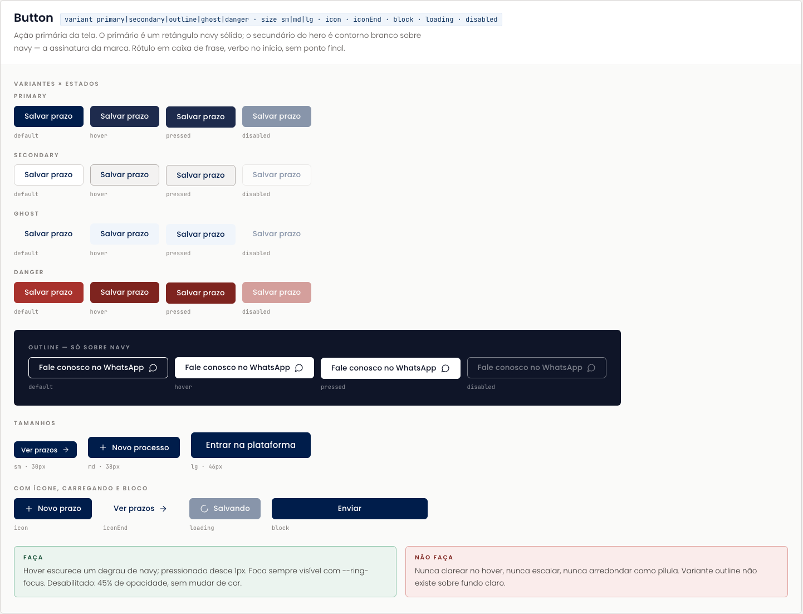

## IconButton

`icon · label (obrigatório) · size sm|md|lg · variant ghost|inverse · active · disabled`

Ação de barra de ferramentas sem rótulo visível. Exige sempre `title` e `aria-label`: é a única situação em que um ícone aparece sem texto na plataforma.

- Figma: [bloco IconButton](https://www.figma.com/design/jEwHxavSrPVQrm3hGSLGtC/edson-alexandre-advogados_design-system?node-id=34-2627)
- Repositório: [`components/core/IconButton.jsx`](https://github.com/Advocondo/ui-kit/blob/main/components/core/IconButton.jsx)

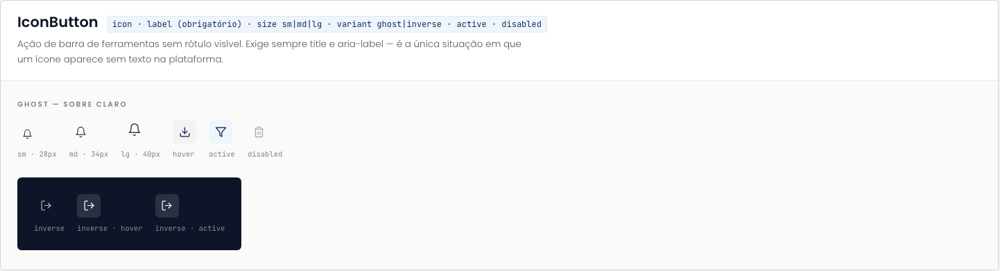

## Card

`tone default|sunken|onNavy|inverse · padding none|sm|md|lg · title · action · interactive`

Superfície de agrupamento. Em fundo claro, borda fina mais sombra sussurrada; sobre navy, sombra escura difusa e sem borda.

- Figma: [bloco Card](https://www.figma.com/design/jEwHxavSrPVQrm3hGSLGtC/edson-alexandre-advogados_design-system?node-id=34-2716)
- Repositório: [`components/core/Card.jsx`](https://github.com/Advocondo/ui-kit/blob/main/components/core/Card.jsx)

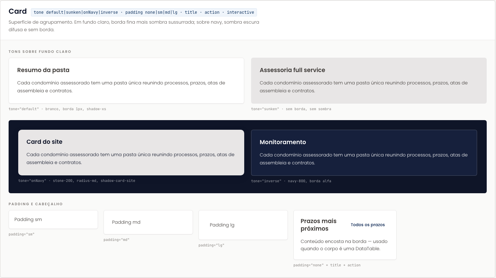

## Badge

`tone neutral|brand|ok|warn|risk|info|solid · size sm|md`

Rótulo de categoria dentro de tabelas e cabeçalhos: área do processo, tipo de documento, ação de auditoria. Retângulo de raio 3px; não confundir com `StatusPill`.

- Figma: [bloco Badge](https://www.figma.com/design/jEwHxavSrPVQrm3hGSLGtC/edson-alexandre-advogados_design-system?node-id=34-2807)
- Repositório: [`components/core/Badge.jsx`](https://github.com/Advocondo/ui-kit/blob/main/components/core/Badge.jsx)

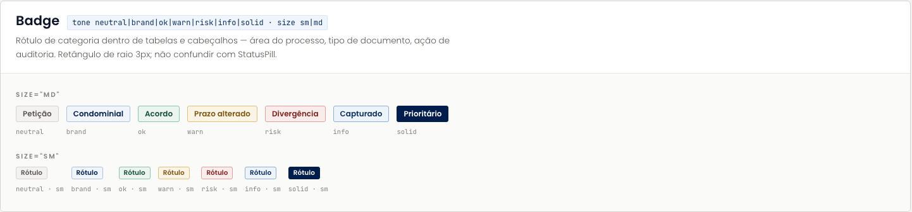

## StatusPill

`status ativo|suspenso|arquivado|ganho|perdido|acordo|prazo|urgente|transitado · label · tone · dot`

Situação de um processo ou prazo. É o único componente, junto dos avatares, que usa raio de pílula. Cada status traz o vocabulário da profissão já embutido no rótulo.

- Figma: [bloco StatusPill](https://www.figma.com/design/jEwHxavSrPVQrm3hGSLGtC/edson-alexandre-advogados_design-system?node-id=34-2898)
- Repositório: [`components/core/StatusPill.jsx`](https://github.com/Advocondo/ui-kit/blob/main/components/core/StatusPill.jsx)

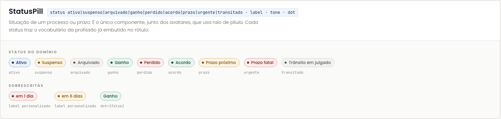

## Tag

`selected · onRemove · onClick`

Filtro aplicado ou alternável nas listagens. Quando clicável, alterna; quando traz `onRemove`, representa um filtro já aplicado que o usuário pode retirar.

- Figma: [bloco Tag](https://www.figma.com/design/jEwHxavSrPVQrm3hGSLGtC/edson-alexandre-advogados_design-system?node-id=34-2988)
- Repositório: [`components/core/Tag.jsx`](https://github.com/Advocondo/ui-kit/blob/main/components/core/Tag.jsx)

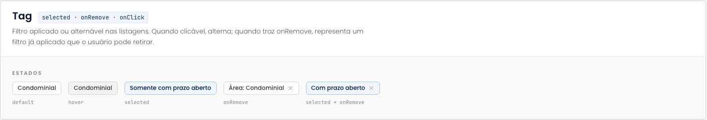

## FieldLabel

`htmlFor · required · hint`

Rótulo de campo. O asterisco de obrigatório é vermelho; a dica fica à direita, em caption discreta.

- Figma: [bloco FieldLabel](https://www.figma.com/design/jEwHxavSrPVQrm3hGSLGtC/edson-alexandre-advogados_design-system?node-id=34-3038)
- Repositório: [`components/forms/FieldLabel.jsx`](https://github.com/Advocondo/ui-kit/blob/main/components/forms/FieldLabel.jsx)

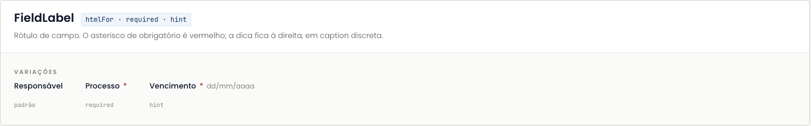

## Input

`value · placeholder · type · icon · invalid · disabled · mono · error`

Campo de texto de 40px. A variante `mono` existe para número CNJ, valores e qualquer dado tabular: traz `tabular-nums`. O bloco mostra os nove estados do campo.

- Figma: [bloco Input](https://www.figma.com/design/jEwHxavSrPVQrm3hGSLGtC/edson-alexandre-advogados_design-system?node-id=34-3073)
- Repositório: [`components/forms/Input.jsx`](https://github.com/Advocondo/ui-kit/blob/main/components/forms/Input.jsx), vitrine em [`components/forms/forms.card.html`](https://github.com/Advocondo/ui-kit/blob/main/components/forms/forms.card.html)

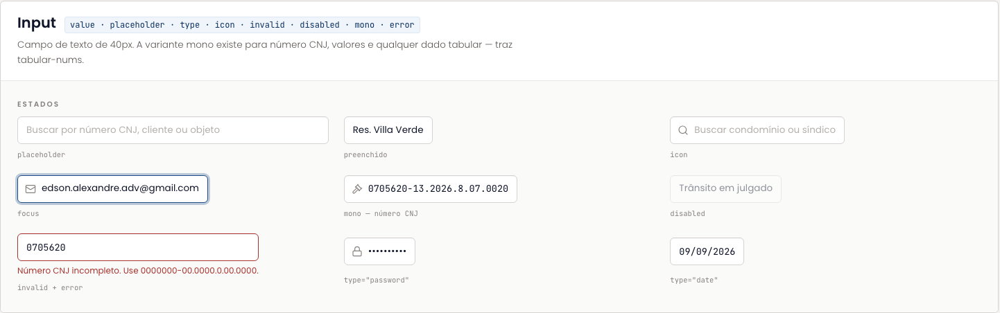

## Select · Textarea · Checkbox · Radio · Switch

`value · options · invalid · disabled · label · description · checked`

Os demais controles de formulário. Todos compartilham a mesma base de campo: 40px de altura, raio 6px, borda `default`, anel de foco navy e opacidade de 45% quando desabilitados. O bloco termina com a composição do formulário de novo prazo.

- Figma: [bloco Select · Textarea · Checkbox · Radio · Switch](https://www.figma.com/design/jEwHxavSrPVQrm3hGSLGtC/edson-alexandre-advogados_design-system?node-id=34-3175)
- Repositório: [`components/forms/`](https://github.com/Advocondo/ui-kit/tree/main/components/forms)

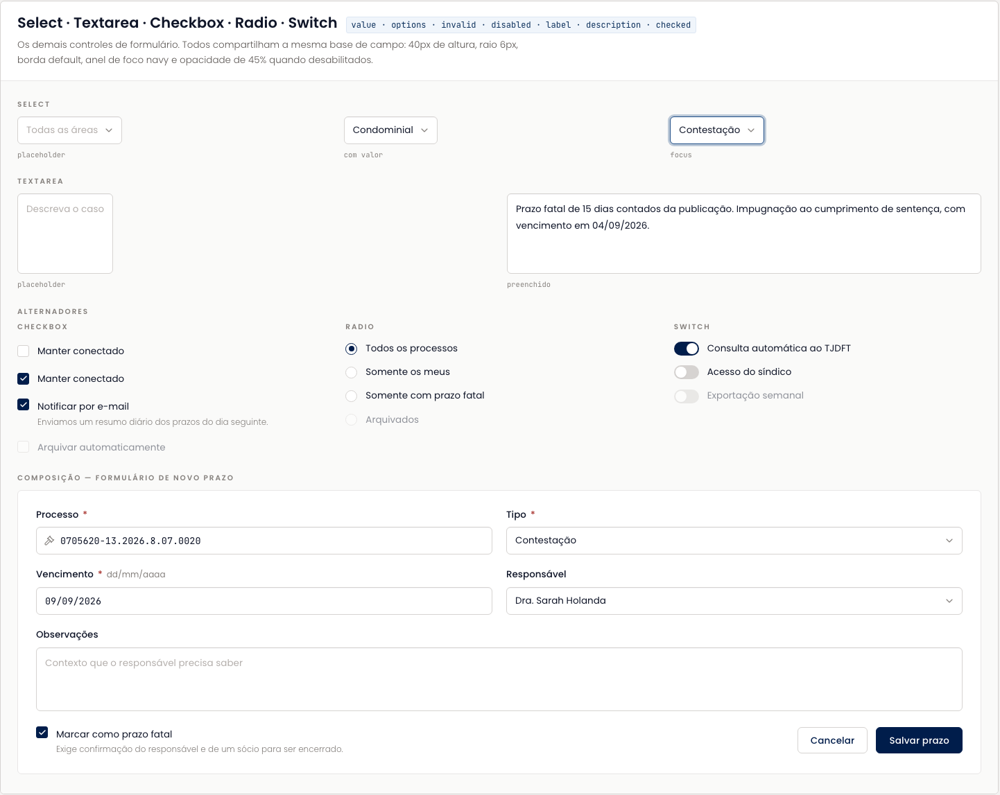

## SidebarNav

`items (id, label, icon, count | section) · activeId · header · footer · 248px`

Navegação principal da plataforma, fixa em 248px sobre navy. O item ativo ganha preenchimento branco a 10% e um marcador `navy-200` de 2px na borda esquerda; as contagens usam mono. Nos protótipos do sistema de acordos, a barra lateral passou a listar Painel, Acordos, Metas e Comissões, Condomínios, Trilha de auditoria e Gestão de Usuários.

- Figma: [bloco SidebarNav](https://www.figma.com/design/jEwHxavSrPVQrm3hGSLGtC/edson-alexandre-advogados_design-system?node-id=34-3375)
- Repositório: [`components/navigation/SidebarNav.jsx`](https://github.com/Advocondo/ui-kit/blob/main/components/navigation/SidebarNav.jsx), vitrine em [`components/navigation/navigation.card.html`](https://github.com/Advocondo/ui-kit/blob/main/components/navigation/navigation.card.html)

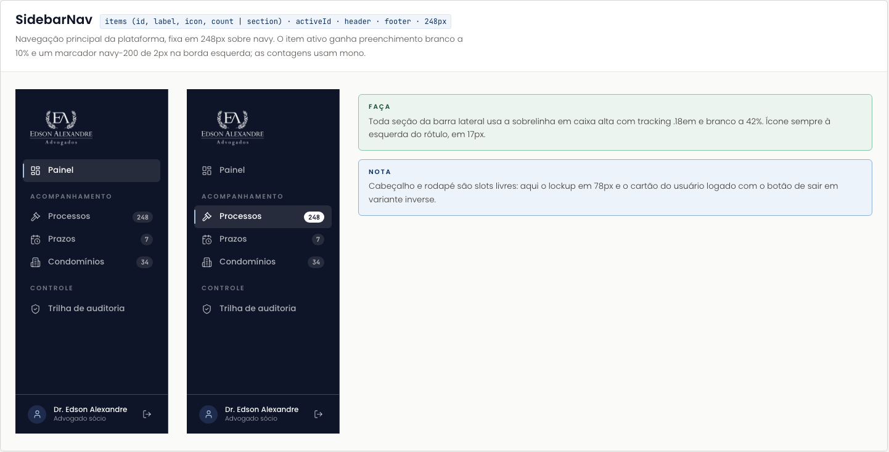

## TopBar · TopBarSearch · Tabs · Breadcrumb

`title · subtitle · breadcrumb · actions · tone light|navy`

Cabeçalho de tela da plataforma, 60px de altura mínima. O tom navy existe para telas de leitura; o padrão claro é o de trabalho.

- Figma: [bloco TopBar · TopBarSearch · Tabs · Breadcrumb](https://www.figma.com/design/jEwHxavSrPVQrm3hGSLGtC/edson-alexandre-advogados_design-system?node-id=34-3552)
- Repositório: [`components/navigation/TopBar.jsx`](https://github.com/Advocondo/ui-kit/blob/main/components/navigation/TopBar.jsx), [`Tabs.jsx`](https://github.com/Advocondo/ui-kit/blob/main/components/navigation/Tabs.jsx), [`Breadcrumb.jsx`](https://github.com/Advocondo/ui-kit/blob/main/components/navigation/Breadcrumb.jsx)

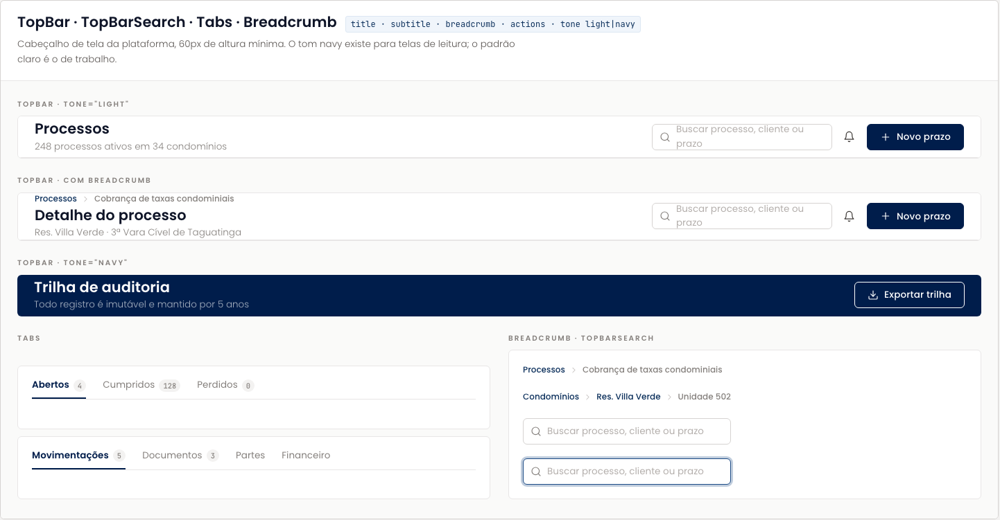

## DataTable · SortHeader

`columns (key, label, align, width, mono, strong, render) · rows · dense · selectedId · onRowClick · empty`

A superfície de trabalho da plataforma. Cabeçalho em sobrelinha caixa alta sobre `stone-50`; colunas numéricas em mono com `tabular-nums` e alinhamento à direita; a linha inteira é clicável quando há `onRowClick`. Formatos brasileiros sempre: número CNJ, datas `dd/mm/aaaa`, valores `R$ 1.234,56`.

- Figma: [bloco DataTable · SortHeader](https://www.figma.com/design/jEwHxavSrPVQrm3hGSLGtC/edson-alexandre-advogados_design-system?node-id=34-3720)
- Repositório: [`components/data/DataTable.jsx`](https://github.com/Advocondo/ui-kit/blob/main/components/data/DataTable.jsx), vitrine em [`components/data/data.card.html`](https://github.com/Advocondo/ui-kit/blob/main/components/data/data.card.html)

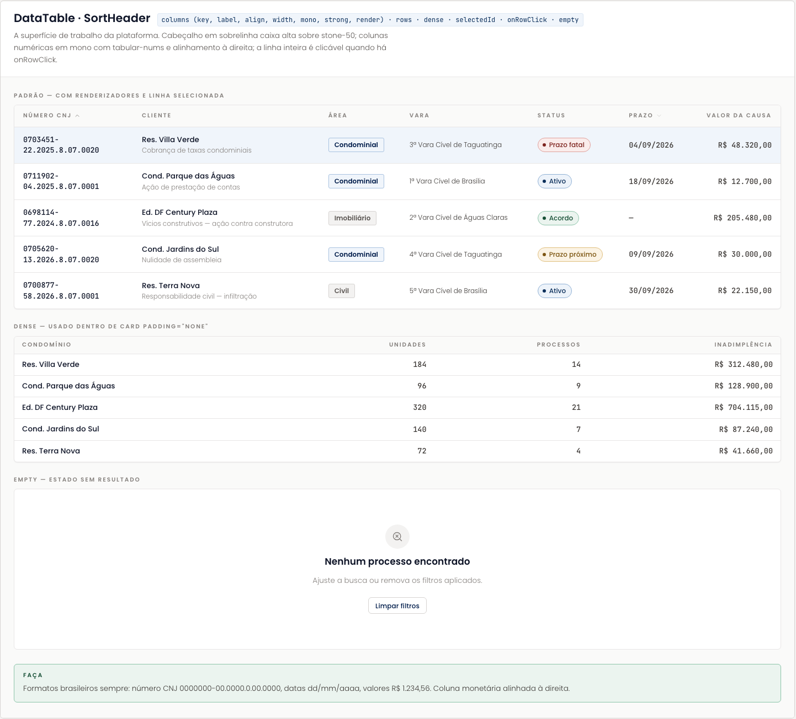

## MetricCard · Timeline · EmptyState

`MetricCard: label, value, unit, delta, deltaTone up|down|neutral, icon, footnote, tone · Timeline: items (title, date, description, meta, icon, tone) · EmptyState: icon, title, description, action, compact`

Os três componentes de leitura do painel. O número do `MetricCard` é o único lugar da plataforma onde Playfair Display aparece; a `Timeline` conta a história do processo em ordem inversa; o `EmptyState` diz o fato e o próximo passo.

- Figma: [bloco MetricCard · Timeline · EmptyState](https://www.figma.com/design/jEwHxavSrPVQrm3hGSLGtC/edson-alexandre-advogados_design-system?node-id=34-3954)
- Repositório: [`components/data/MetricCard.jsx`](https://github.com/Advocondo/ui-kit/blob/main/components/data/MetricCard.jsx), [`Timeline.jsx`](https://github.com/Advocondo/ui-kit/blob/main/components/data/Timeline.jsx), [`EmptyState.jsx`](https://github.com/Advocondo/ui-kit/blob/main/components/data/EmptyState.jsx)

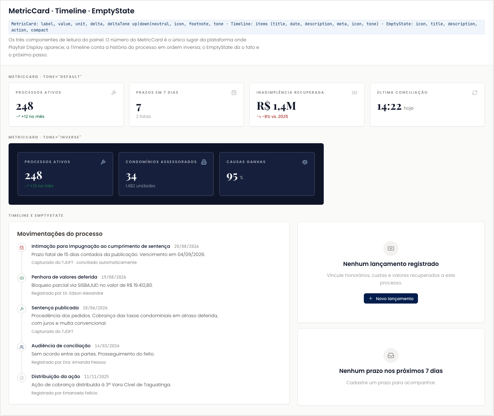

## Alert · Toast · Dialog · Tooltip

`tone info|ok|warn|risk · title · action · onClose · Dialog: title, description, footer, width · Tooltip: label, placement`

A camada de feedback. O `Alert` vive dentro do fluxo da tela; o `Toast` é sempre `navy-900`, no canto inferior direito; o `Dialog` flutua sobre um véu navy a 62%. Texto neutro e instrumental, sem exclamação. Os diálogos dos protótipos de acordos (Novo Acordo, Importar Inadimplentes, Registrar Baixa, Novo condomínio, Convidar Membro) derivam deste bloco.

- Figma: [bloco Alert · Toast · Dialog · Tooltip](https://www.figma.com/design/jEwHxavSrPVQrm3hGSLGtC/edson-alexandre-advogados_design-system?node-id=34-4231)
- Repositório: [`components/feedback/`](https://github.com/Advocondo/ui-kit/tree/main/components/feedback), vitrine em [`components/feedback/feedback.card.html`](https://github.com/Advocondo/ui-kit/blob/main/components/feedback/feedback.card.html)

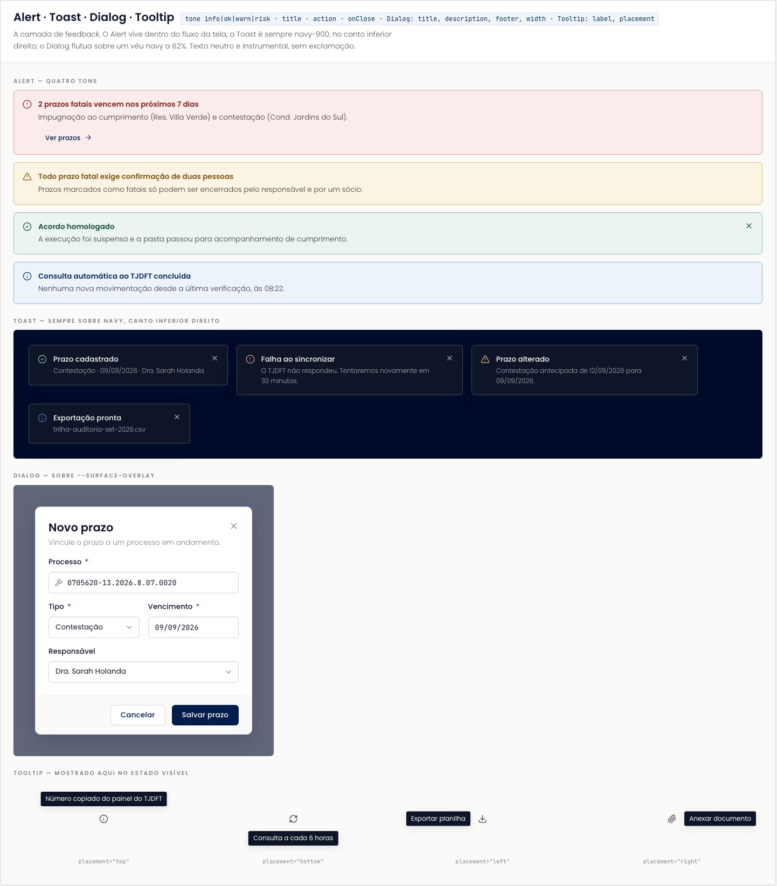

## SectionTitle · PracticeCard · TeamCard

`SectionTitle: size sm|md|lg, sub, align, onNavy, sentenceCase · PracticeCard: title, children · TeamCard: name, role, photo, width`

Os componentes exclusivos do site institucional. Todos assumem fundo navy por padrão; o `SectionTitle` em caixa de frase marca a mudança de voz da faixa clara e deve ser usado com moderação. As fotos da equipe não acompanham o repositório, por isso os retratos aparecem como placeholder.

- Figma: [bloco SectionTitle · PracticeCard · TeamCard](https://www.figma.com/design/jEwHxavSrPVQrm3hGSLGtC/edson-alexandre-advogados_design-system?node-id=34-4489)
- Repositório: [`components/brand/`](https://github.com/Advocondo/ui-kit/tree/main/components/brand), vitrine em [`components/brand/brand.card.html`](https://github.com/Advocondo/ui-kit/blob/main/components/brand/brand.card.html)

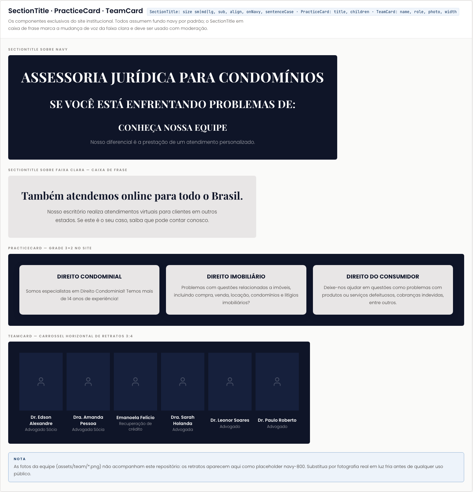
