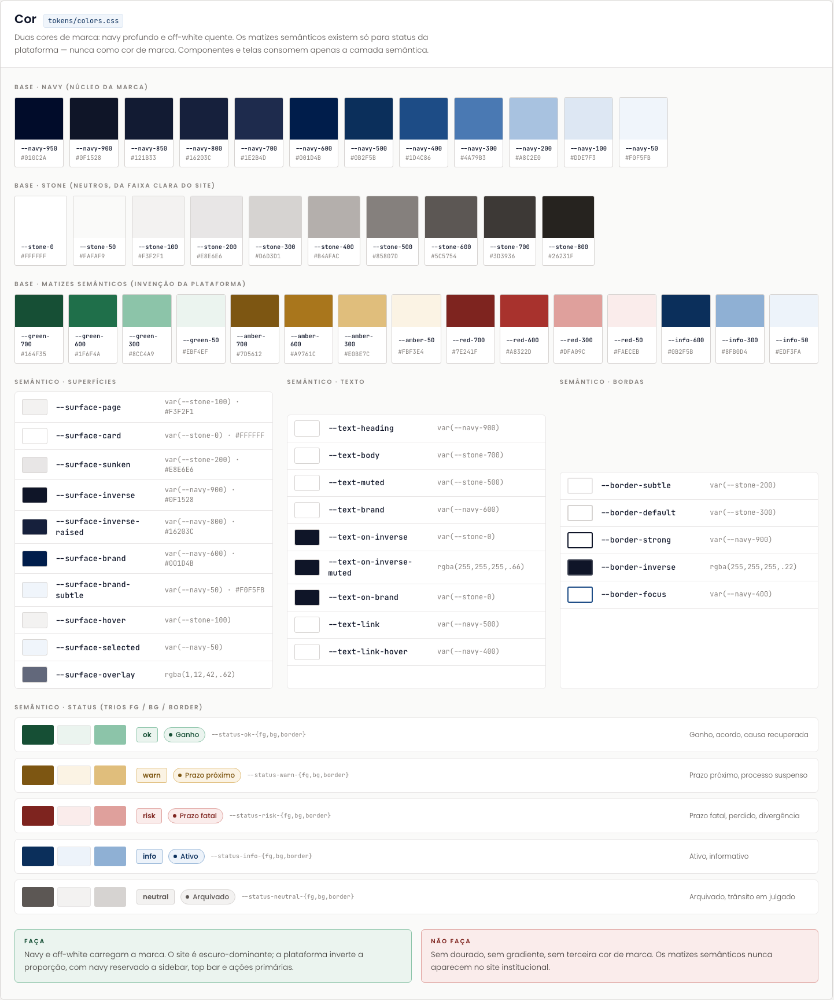
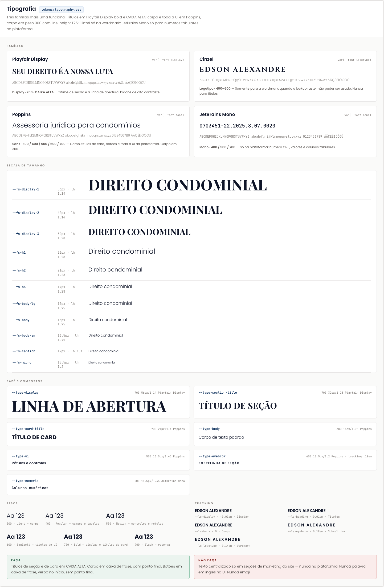
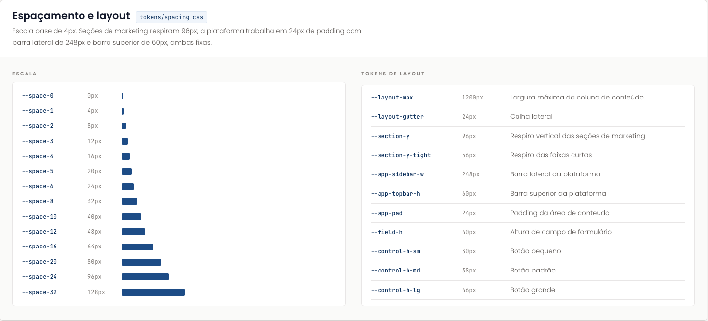
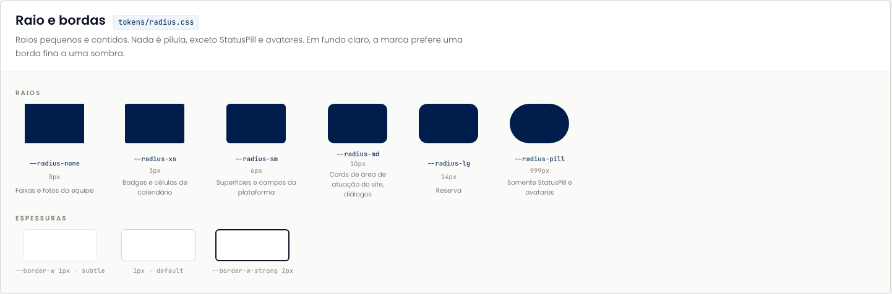
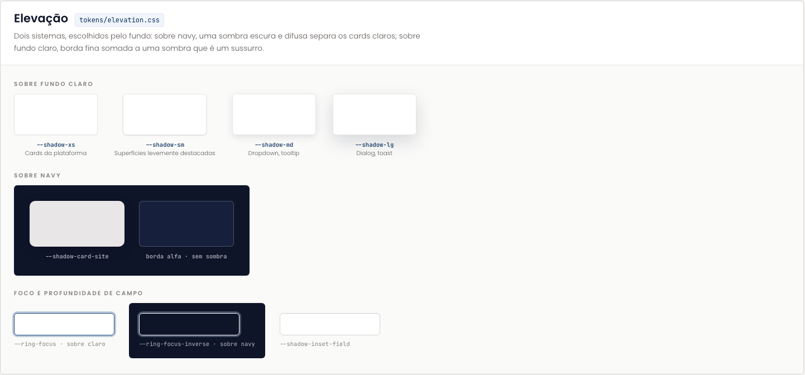
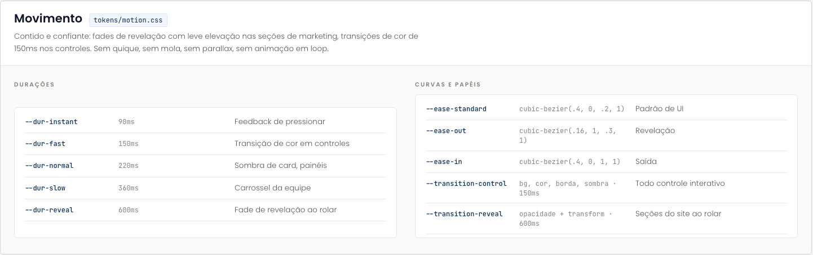
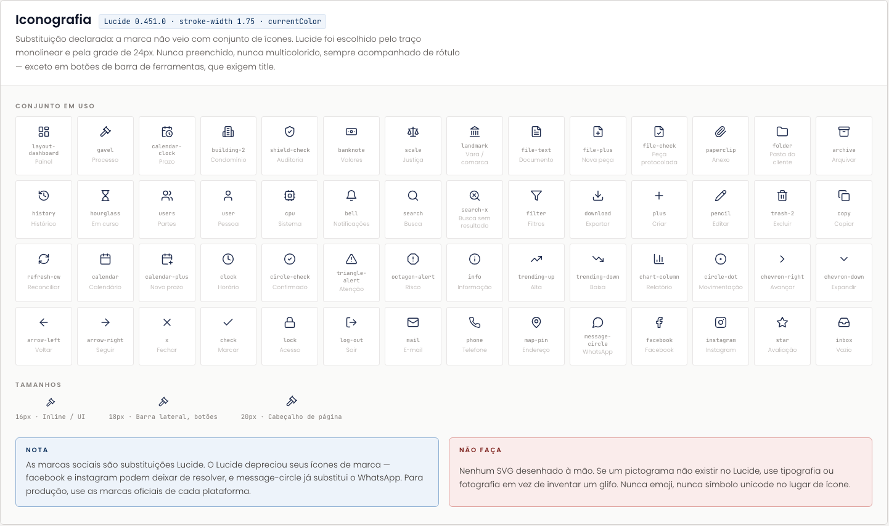
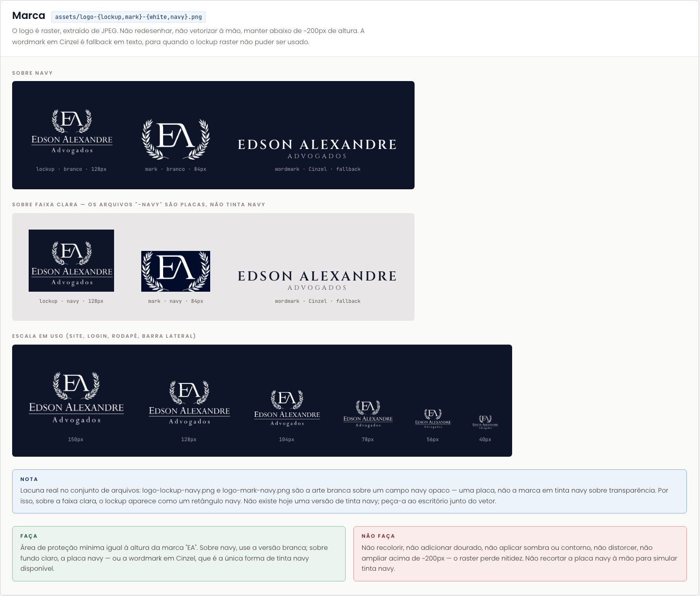

# Fundamentos

A camada de tokens: o que existe antes de qualquer componente. Componentes e telas consomem apenas a camada semântica ou os papéis compostos de tipografia, nunca um token base diretamente.

No Figma, os oito blocos abaixo estão na seção **01 · Fundamentos** ([34:186](https://www.figma.com/design/jEwHxavSrPVQrm3hGSLGtC/edson-alexandre-advogados_design-system?node-id=34-186)) e são idênticos ao repositório. As capturas desta página foram geradas a partir da mesma folha HTML que originou a importação.

| Bloco | Fonte no repositório | Nó no Figma |
| --- | --- | --- |
| [Cor](#cor) | `tokens/colors.css` | [34:211](https://www.figma.com/design/jEwHxavSrPVQrm3hGSLGtC/edson-alexandre-advogados_design-system?node-id=34-211) |
| [Tipografia](#tipografia) | `tokens/typography.css`, `tokens/fonts.css` | [34:819](https://www.figma.com/design/jEwHxavSrPVQrm3hGSLGtC/edson-alexandre-advogados_design-system?node-id=34-819) |
| [Espaçamento e layout](#espacamento-e-layout) | `tokens/spacing.css` | [34:1157](https://www.figma.com/design/jEwHxavSrPVQrm3hGSLGtC/edson-alexandre-advogados_design-system?node-id=34-1157) |
| [Raio e bordas](#raio-e-bordas) | `tokens/radius.css` | [34:1336](https://www.figma.com/design/jEwHxavSrPVQrm3hGSLGtC/edson-alexandre-advogados_design-system?node-id=34-1336) |
| [Elevação](#elevacao) | `tokens/elevation.css` | [34:1427](https://www.figma.com/design/jEwHxavSrPVQrm3hGSLGtC/edson-alexandre-advogados_design-system?node-id=34-1427) |
| [Movimento](#movimento) | `tokens/motion.css` | [34:1506](https://www.figma.com/design/jEwHxavSrPVQrm3hGSLGtC/edson-alexandre-advogados_design-system?node-id=34-1506) |
| [Iconografia](#iconografia) | `components/core/Icon.jsx` | [34:1594](https://www.figma.com/design/jEwHxavSrPVQrm3hGSLGtC/edson-alexandre-advogados_design-system?node-id=34-1594) |
| [Marca](#marca) | `assets/logo-*.png`, `components/brand/Logo.jsx` | [34:2270](https://www.figma.com/design/jEwHxavSrPVQrm3hGSLGtC/edson-alexandre-advogados_design-system?node-id=34-2270) |

## Cor

Duas cores de marca: navy profundo e off-white quente. Os matizes semânticos existem só para status da plataforma, nunca como cor de marca. Componentes e telas consomem apenas a camada semântica.

O bloco mostra as escalas base (`--navy-*`, `--stone-*`, `--green/amber/red/info-*`), as três tabelas semânticas (superfícies, texto, bordas) e os cinco trios de status (`--status-{ok,warn,risk,info,neutral}-{fg,bg,border}`).

- Figma: [bloco Cor](https://www.figma.com/design/jEwHxavSrPVQrm3hGSLGtC/edson-alexandre-advogados_design-system?node-id=34-211)
- Repositório: [`tokens/colors.css`](https://github.com/Advocondo/ui-kit/blob/main/tokens/colors.css) e os specimens em [`guidelines/colors-*.html`](https://github.com/Advocondo/ui-kit/tree/main/guidelines)

## Tipografia

Três famílias mais uma funcional. Títulos em Playfair Display bold e CAIXA ALTA; corpo e toda a UI em Poppins, corpo em peso 300 com entrelinha 1.75; Cinzel só na wordmark; JetBrains Mono só para números tabulares na plataforma. O bloco traz espécime e alfabeto de cada família, a escala de tamanhos, os papéis compostos, pesos e tracking.

- Figma: [bloco Tipografia](https://www.figma.com/design/jEwHxavSrPVQrm3hGSLGtC/edson-alexandre-advogados_design-system?node-id=34-819)
- Repositório: [`tokens/typography.css`](https://github.com/Advocondo/ui-kit/blob/main/tokens/typography.css), [`tokens/fonts.css`](https://github.com/Advocondo/ui-kit/blob/main/tokens/fonts.css) e os specimens em [`guidelines/type-*.html`](https://github.com/Advocondo/ui-kit/tree/main/guidelines)

## Espaçamento e layout

Escala base de 4px. Seções de marketing respiram 96px; a plataforma trabalha em 24px de padding com barra lateral de 248px e barra superior de 60px, ambas fixas.

- Figma: [bloco Espaçamento e layout](https://www.figma.com/design/jEwHxavSrPVQrm3hGSLGtC/edson-alexandre-advogados_design-system?node-id=34-1157)
- Repositório: [`tokens/spacing.css`](https://github.com/Advocondo/ui-kit/blob/main/tokens/spacing.css) e os specimens em [`guidelines/spacing-*.html`](https://github.com/Advocondo/ui-kit/tree/main/guidelines)

## Raio e bordas

Raios pequenos e contidos. Nada é pílula, exceto `StatusPill` e avatares. Em fundo claro, a marca prefere uma borda fina a uma sombra.

- Figma: [bloco Raio e bordas](https://www.figma.com/design/jEwHxavSrPVQrm3hGSLGtC/edson-alexandre-advogados_design-system?node-id=34-1336)
- Repositório: [`tokens/radius.css`](https://github.com/Advocondo/ui-kit/blob/main/tokens/radius.css) e [`guidelines/brand-radius-cards.html`](https://github.com/Advocondo/ui-kit/blob/main/guidelines/brand-radius-cards.html)

## Elevação

Dois sistemas, escolhidos pelo fundo: sobre navy, uma sombra escura e difusa separa os cards claros; sobre fundo claro, borda fina somada a uma sombra que é um sussurro.

- Figma: [bloco Elevação](https://www.figma.com/design/jEwHxavSrPVQrm3hGSLGtC/edson-alexandre-advogados_design-system?node-id=34-1427)
- Repositório: [`tokens/elevation.css`](https://github.com/Advocondo/ui-kit/blob/main/tokens/elevation.css) e [`guidelines/brand-elevation.html`](https://github.com/Advocondo/ui-kit/blob/main/guidelines/brand-elevation.html)

## Movimento

Contido e confiante: fades de revelação com leve elevação nas seções de marketing, transições de cor de 150ms nos controles. Sem quique, sem mola, sem parallax, sem animação em loop.

- Figma: [bloco Movimento](https://www.figma.com/design/jEwHxavSrPVQrm3hGSLGtC/edson-alexandre-advogados_design-system?node-id=34-1506)
- Repositório: [`tokens/motion.css`](https://github.com/Advocondo/ui-kit/blob/main/tokens/motion.css) e [`guidelines/brand-motion.html`](https://github.com/Advocondo/ui-kit/blob/main/guidelines/brand-motion.html)

## Iconografia

Substituição declarada: a marca não veio com conjunto de ícones. Lucide (0.451.0) foi escolhido pelo traço monolinear e pela grade de 24px. `stroke-width` 1.75, `currentColor`, 16/18/20px, nunca preenchido, nunca multicolorido, sempre acompanhado de rótulo, exceto em botões de barra de ferramentas, que exigem `title`. O bloco lista os 56 ícones nomeados em uso.

- Figma: [bloco Iconografia](https://www.figma.com/design/jEwHxavSrPVQrm3hGSLGtC/edson-alexandre-advogados_design-system?node-id=34-1594)
- Repositório: [`components/core/Icon.jsx`](https://github.com/Advocondo/ui-kit/blob/main/components/core/Icon.jsx) e [`guidelines/brand-iconography.html`](https://github.com/Advocondo/ui-kit/blob/main/guidelines/brand-iconography.html)

## Marca

O logo é raster, extraído de JPEG. Não redesenhar, não vetorizar à mão, manter abaixo de ~200px de altura. A wordmark em Cinzel é fallback em texto, para quando o lockup raster não puder ser usado. O bloco mostra o lockup e a marca sobre navy, a escala em uso (site, login, rodapé, barra lateral) e registra que os arquivos `-navy` são placas opacas, não a marca em tinta navy.

- Figma: [bloco Marca](https://www.figma.com/design/jEwHxavSrPVQrm3hGSLGtC/edson-alexandre-advogados_design-system?node-id=34-2270)
- Repositório: [`assets/`](https://github.com/Advocondo/ui-kit/tree/main/assets), [`components/brand/Logo.jsx`](https://github.com/Advocondo/ui-kit/blob/main/components/brand/Logo.jsx) e [`guidelines/brand-mark.html`](https://github.com/Advocondo/ui-kit/blob/main/guidelines/brand-mark.html)

