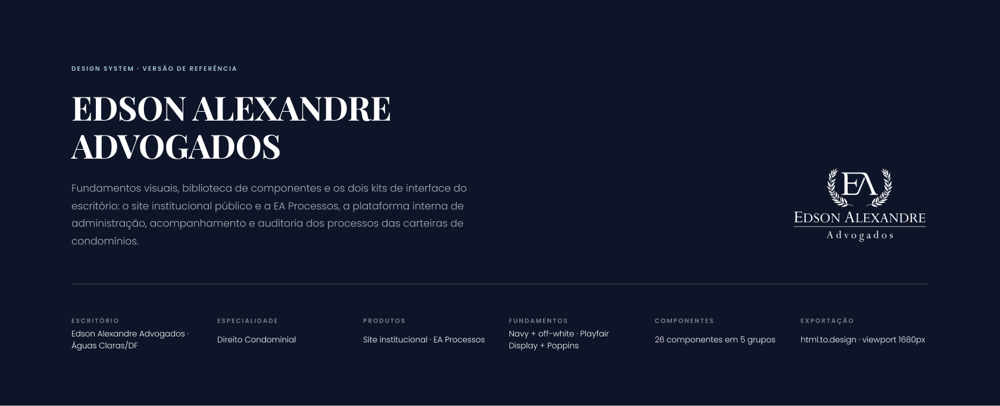

# Design system no Figma

O design system de **Edson Alexandre Advogados** e da plataforma **EA Processos** vive em dois lugares que precisam contar a mesma história:

- o repositório [`Advocondo/ui-kit`](https://github.com/Advocondo/ui-kit), fonte de verdade dos tokens, dos componentes React e dos dois kits de interface;
- o projeto no Figma, onde as telas viraram protótipos editáveis e onde o sistema de **Gestão de Acordos Extrajudiciais** está sendo desenhado.

[Abrir o projeto no Figma](https://www.figma.com/design/jEwHxavSrPVQrm3hGSLGtC/edson-alexandre-advogados_design-system?node-id=0-1&t=cwhLECeKiLwiaQXZ-1){ .md-button .md-button--primary }

## Como o arquivo foi montado

O arquivo tem uma única página, **Cover**, com uma seção chamada **Design System**. Essa seção é a importação, via extensão **html.to.design**, de uma folha HTML autocontida gerada a partir do repositório (`figma-export.html`, 1 MB, sem JavaScript, fontes do Google Fonts, viewport de 1680px). A folha reúne, em ordem:

| Bloco no Figma | O que contém | Nó | Página de referência |
| --- | --- | --- | --- |
| Cabeçalho | Capa, resumo e índice das quatro seções | [34:7](https://www.figma.com/design/jEwHxavSrPVQrm3hGSLGtC/edson-alexandre-advogados_design-system?node-id=34-7) | esta página |
| 01 · Fundamentos | Cor, tipografia, espaçamento, raio, elevação, movimento, iconografia e marca | [34:186](https://www.figma.com/design/jEwHxavSrPVQrm3hGSLGtC/edson-alexandre-advogados_design-system?node-id=34-186) | [Fundamentos](fundamentos.md) |
| 02 · Componentes | 26 componentes em 15 blocos, com assinatura de props e matriz de variantes | [34:2360](https://www.figma.com/design/jEwHxavSrPVQrm3hGSLGtC/edson-alexandre-advogados_design-system?node-id=34-2360) | [Componentes](componentes.md) |
| 03 · Kits de interface | Site institucional e as telas da EA Processos, hoje editadas para o sistema de acordos | [34:4632](https://www.figma.com/design/jEwHxavSrPVQrm3hGSLGtC/edson-alexandre-advogados_design-system?node-id=34-4632) | [Protótipos](../prototipos/index.md) |
| 04 · Regras e ressalvas | Regras inegociáveis, estados de interação e o que ainda é substituição ou proposta | [34:7512](https://www.figma.com/design/jEwHxavSrPVQrm3hGSLGtC/edson-alexandre-advogados_design-system?node-id=34-7512) | [Regras e ressalvas](regras.md) |
| Rodapé | Assinatura, contatos do escritório e nota sobre a exportação | [34:7680](https://www.figma.com/design/jEwHxavSrPVQrm3hGSLGtC/edson-alexandre-advogados_design-system?node-id=34-7680) | esta página |

## Como ler os identificadores

Cada link desta documentação aponta para um nó específico do arquivo (`node-id`). Ao abrir, o Figma centraliza o nó na tela.

- Nós com prefixo `34:` vieram da importação original da folha HTML. Se o bloco ainda tem esse prefixo e o conteúdo bate com o repositório, ele não foi tocado no Figma.
- Nós com outros prefixos (`51:`, `55:`, `62:`, `124:`) foram criados depois, dentro do Figma. É o caso das telas novas do sistema de acordos e dos diálogos que acompanham as listagens.
- Várias telas herdaram o nó da importação mas tiveram o conteúdo editado no Figma. O catálogo de [protótipos](../prototipos/index.md) marca cada caso.

## O que muda entre o repositório e o Figma

O repositório continua sendo a fonte de verdade dos **fundamentos** e dos **componentes**: esses blocos estão idênticos no Figma. Já os **kits** divergiram de propósito. No repositório, a EA Processos é uma proposta de acompanhamento processual (processos, prazos, movimentações). No Figma, as mesmas telas foram reaproveitadas como protótipos do sistema de **Gestão de Acordos Extrajudiciais** (acordos, parcelas, baixas, metas e comissões, usuários). A seção de protótipos documenta tela a tela o que se manteve, o que foi editado e o que é novo.

## Referências no repositório

| Caminho | O que é |
| --- | --- |
| [`readme.md`](https://github.com/Advocondo/ui-kit/blob/main/readme.md) | Marca, voz e fundamentos visuais. Leia antes de qualquer trabalho de design. |
| [`tokens/`](https://github.com/Advocondo/ui-kit/tree/main/tokens) | Tokens CSS: camada base e camada semântica. |
| [`components/`](https://github.com/Advocondo/ui-kit/tree/main/components) | Componentes React em JSX puro, um trio por componente (`.jsx`, `.d.ts`, `.prompt.md`). |
| [`guidelines/`](https://github.com/Advocondo/ui-kit/tree/main/guidelines) | Specimens dos fundamentos, um HTML por cartão. |
| [`ui_kits/`](https://github.com/Advocondo/ui-kit/tree/main/ui_kits) | Site institucional e EA Processos, montados só com os componentes do sistema. |
| [`LIBRARY.md`](https://github.com/Advocondo/ui-kit/blob/main/LIBRARY.md) | Como consumir a biblioteca compilada em um projeto TypeScript/React. |
