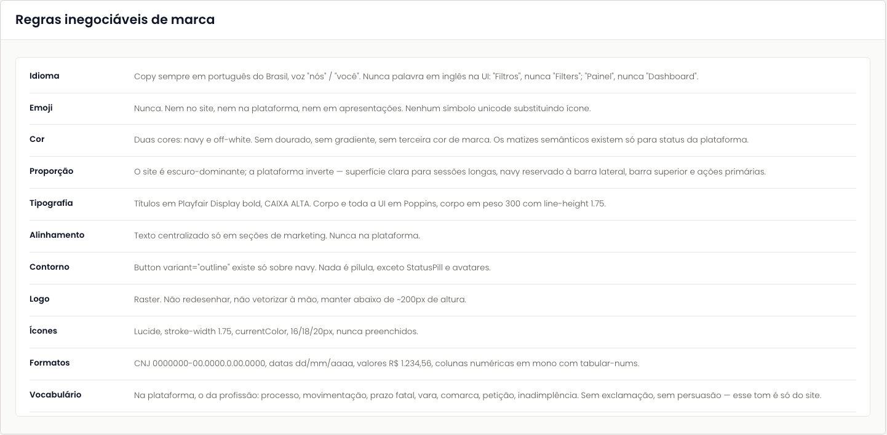
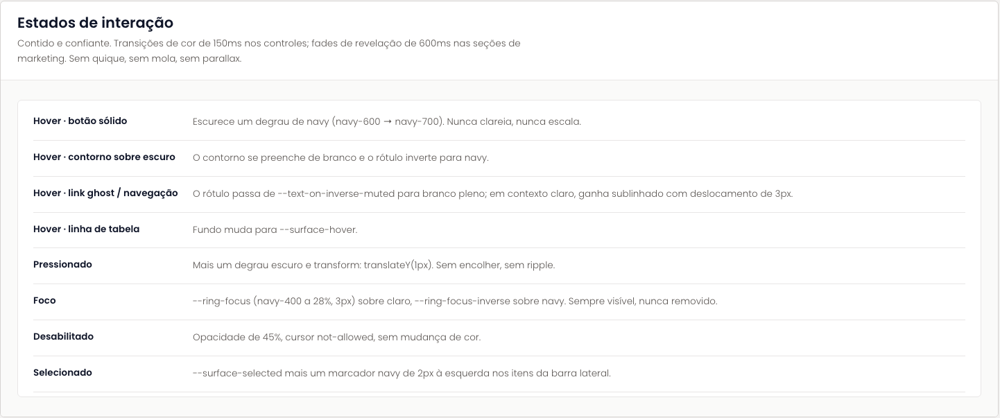
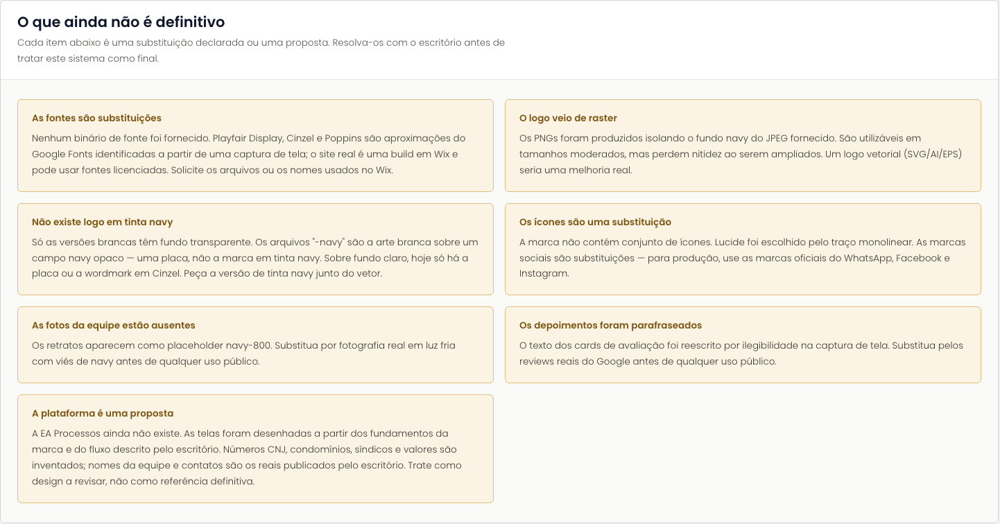

# Regras e ressalvas

O que não se negocia na marca, como cada estado de interação se comporta, e tudo neste sistema que ainda é substituição ou proposta. No Figma, os três blocos estão na seção **04 · Regras e ressalvas** ([34:7512](https://www.figma.com/design/jEwHxavSrPVQrm3hGSLGtC/edson-alexandre-advogados_design-system?node-id=34-7512)). A fonte de verdade continua sendo o [`readme.md`](https://github.com/Advocondo/ui-kit/blob/main/readme.md) do repositório.

## Regras inegociáveis de marca

[Abrir o bloco no Figma](https://www.figma.com/design/jEwHxavSrPVQrm3hGSLGtC/edson-alexandre-advogados_design-system?node-id=34-7523)

| Regra | O que vale |
| --- | --- |
| Idioma | Copy sempre em português do Brasil, voz "nós" / "você". Nunca palavra em inglês na interface: "Filtros", nunca "Filters"; "Painel", nunca "Dashboard". |
| Emoji | Nunca. Nem no site, nem na plataforma, nem em apresentações. Nenhum símbolo unicode substituindo ícone. |
| Cor | Duas cores: navy e off-white. Sem dourado, sem gradiente, sem terceira cor de marca. Os matizes semânticos existem só para status da plataforma. |
| Proporção | O site é escuro-dominante; a plataforma inverte: superfície clara para sessões longas, navy reservado à barra lateral, barra superior e ações primárias. |
| Tipografia | Títulos em Playfair Display bold, CAIXA ALTA. Corpo e toda a UI em Poppins, corpo em peso 300 com entrelinha 1.75. |
| Alinhamento | Texto centralizado só em seções de marketing. Nunca na plataforma. |
| Contorno | `Button variant="outline"` existe só sobre navy. Nada é pílula, exceto `StatusPill` e avatares. |
| Logo | Raster. Não redesenhar, não vetorizar à mão, manter abaixo de ~200px de altura. |
| Ícones | Lucide, `stroke-width` 1.75, `currentColor`, 16/18/20px, nunca preenchidos. |
| Formatos | CNJ `0000000-00.0000.0.00.0000`, datas `dd/mm/aaaa`, valores `R$ 1.234,56`, colunas numéricas em mono com `tabular-nums`. |
| Vocabulário | Na plataforma, o da profissão: processo, movimentação, prazo fatal, vara, comarca, petição, inadimplência. Sem exclamação, sem persuasão; esse tom é só do site. |

## Estados de interação

[Abrir o bloco no Figma](https://www.figma.com/design/jEwHxavSrPVQrm3hGSLGtC/edson-alexandre-advogados_design-system?node-id=34-7585)

Contido e confiante. Transições de cor de 150ms nos controles; fades de revelação de 600ms nas seções de marketing. Sem quique, sem mola, sem parallax.

| Estado | Comportamento |
| --- | --- |
| Hover, botão sólido | Escurece um degrau de navy (`navy-600` para `navy-700`). Nunca clareia, nunca escala. |
| Hover, contorno sobre escuro | O contorno se preenche de branco e o rótulo inverte para navy. |
| Hover, link ghost ou navegação | O rótulo passa de `--text-on-inverse-muted` para branco pleno; em contexto claro, ganha sublinhado com deslocamento de 3px. |
| Hover, linha de tabela | Fundo muda para `--surface-hover`. |
| Pressionado | Mais um degrau escuro e `transform: translateY(1px)`. Sem encolher, sem ripple. |
| Foco | `--ring-focus` (navy-400 a 28%, 3px) sobre claro, `--ring-focus-inverse` sobre navy. Sempre visível, nunca removido. |
| Desabilitado | Opacidade de 45%, cursor `not-allowed`, sem mudança de cor. |
| Selecionado | `--surface-selected` mais um marcador navy de 2px à esquerda nos itens da barra lateral. |

## O que ainda não é definitivo

[Abrir o bloco no Figma](https://www.figma.com/design/jEwHxavSrPVQrm3hGSLGtC/edson-alexandre-advogados_design-system?node-id=34-7634)

Cada item abaixo é uma substituição declarada ou uma proposta. Resolva-os com o escritório antes de tratar este sistema como final.

- **As fontes são substituições.** Nenhum binário de fonte foi fornecido. Playfair Display, Cinzel e Poppins são aproximações do Google Fonts identificadas a partir de uma captura de tela; o site real é uma build em Wix e pode usar fontes licenciadas.
- **O logo veio de raster.** Os PNGs foram produzidos isolando o fundo navy do JPEG fornecido. Um logo vetorial (SVG/AI/EPS) seria uma melhoria real.
- **Não existe logo em tinta navy.** Só as versões brancas têm fundo transparente. Os arquivos `-navy` são a arte branca sobre um campo navy opaco.
- **Os ícones são uma substituição.** Lucide foi escolhido pelo traço monolinear. Para produção, use as marcas oficiais do WhatsApp, Facebook e Instagram.
- **As fotos da equipe estão ausentes.** Os retratos aparecem como placeholder `navy-800`.
- **Os depoimentos foram parafraseados.** Substitua pelos reviews reais do Google antes de qualquer uso público.
- **A plataforma é uma proposta.** A EA Processos ainda não existe. Números CNJ, condomínios, síndicos e valores são inventados; nomes da equipe e contatos são os reais publicados pelo escritório.

