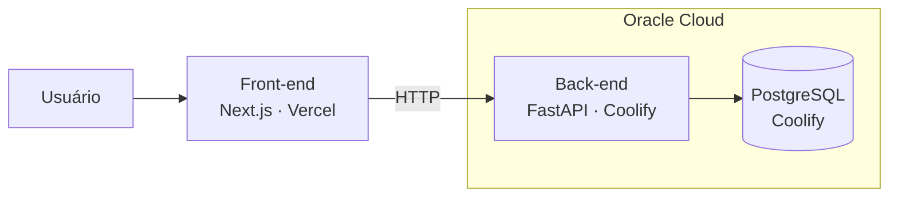

# Deploy

O Advocondo é publicado em dois ambientes separados: o front-end roda na **Vercel**, e o back-end e o banco de dados rodam em uma máquina na **Oracle Cloud**, gerenciada pelo **Coolify**.



| Parte | Repositório | Hospedagem | Como é publicado |
| --- | --- | --- | --- |
| Front-end | [`Advocondo/front`](https://github.com/Advocondo/front) | Vercel | Build automático a cada push na branch `main` |
| Back-end | [`Advocondo/back`](https://github.com/Advocondo/back) | Oracle Cloud + Coolify | Coolify faz o build da imagem Docker de produção (`Dockerfile.prod`) |
| Banco de dados | — | Oracle Cloud + Coolify | PostgreSQL gerenciado pelo mesmo Coolify do back-end |

## Front-end na Vercel

A Vercel detecta o Next.js e roda `npm run build`. Não é preciso nenhum `vercel.json`.

O `next.config.ts` usa `output: "standalone"` apenas fora da Vercel, porque essa opção é necessária para a imagem Docker (`Dockerfile`), mas quebra o build da Vercel com o erro `ENOENT: ... .next/next-server.js.nft.json`:

```ts
output: process.env.VERCEL ? undefined : "standalone",
```

A Vercel define `VERCEL=1` durante o build, então a mesma configuração serve para os dois casos.

## Back-end na Oracle Cloud com Coolify

O [Coolify](https://coolify.io) roda em uma instância da Oracle Cloud e faz o build e a execução do back-end a partir do repositório `Advocondo/back`.

- **Imagem:** `Dockerfile.prod`, um build multi-stage com `uv`. A imagem final roda como usuário não-root e sobe a API com `fastapi run` na porta `8000`.
- **Banco de dados:** o PostgreSQL também é um recurso do mesmo Coolify, na mesma instância. O back-end se conecta a ele pela `DATABASE_URL`.
- **Variáveis de ambiente:** são configuradas no painel do Coolify, e não no repositório. O `.env.example` lista as variáveis esperadas.
- **Verificação:** a rota `GET /health` confirma se a API está no ar.

!!! note "O `docker-compose.yml` é só para desenvolvimento"
    O `docker-compose.yml` do back-end usa o `Dockerfile.dev`, com hot reload e o código montado como volume. Ele não é usado em produção.
