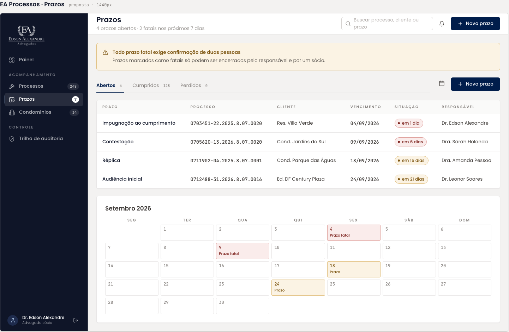

# Acompanhamento Mensal

Tela de uso diário: conferência das parcelas do mês e baixa manual dos pagamentos. Herdou o nó da tela de Prazos (indicadores, tabela e calendário) e ganhou o diálogo "Registrar Baixa" em um frame separado.

| | |
| --- | --- |
| Origem | Tela **editada no Figma** a partir de Prazos; diálogo **criado no Figma** |
| Nós no Figma | tela [34:5930](https://www.figma.com/design/jEwHxavSrPVQrm3hGSLGtC/edson-alexandre-advogados_design-system?node-id=34-5930) · Registrar Baixa [124:946](https://www.figma.com/design/jEwHxavSrPVQrm3hGSLGtC/edson-alexandre-advogados_design-system?node-id=124-946) |
| Fonte da tela de origem | [`ui_kits/plataforma_processos/Prazos.jsx`](https://github.com/Advocondo/ui-kit/blob/main/ui_kits/plataforma_processos/Prazos.jsx) |
| Componentes | `SidebarNav`, `TopBar`, `MetricCard` (três), `DataTable`, `StatusPill`, `IconButton` (dar baixa), calendário mensal, `Dialog`, `FieldLabel`, `Input mono`, `Switch` |
| Histórias de usuário | [US25](../historias/ep04-parcelas.md#us25) (faturas do mês), [US26](../historias/ep04-parcelas.md#us26) (baixa), [US27](../historias/ep04-parcelas.md#us27) (atraso) e [US29](../historias/ep04-parcelas.md#us29) (nota fiscal). [US28](../historias/ep04-parcelas.md#us28) (pagamento parcial) só se o campo Valor aceitar valor menor; a lista não tem devedor nem filtros. Corresponde à tela "Faturas do mês" dos protótipos de requisito. Ver a [cobertura das histórias](cobertura-historias.md). |

## Tela

**Indicadores**: Total a receber no mês R$ 22.000,00; Valor Recebido R$ 14.500,00; Inadimplência do mês R$ 7.500,00.

**Tabela de parcelas**, com colunas Condomínio, Unidade, Parcela, Vencimento, Valor, Recebedor, Responsável, Situação e Dar Baixa:

| Condomínio | Unidade | Parcela | Vencimento | Valor | Recebedor | Responsável | Situação |
| --- | --- | --- | --- | --- | --- | --- | --- |
| Residencial Splendor | Bloco D | 03/10 | 04/09/2026 | R$ 450,00 | Boleto | | Em Aberto |
| Edifício Central | 1302 | 01/06 | 10/09/2026 | R$ 500,00 | PIX | Arthur | Pago |
| Cond. Lake View | 2185 | 04/12 | 20/08/2026 | R$ 741,66 | | | Atrasado |

**Calendário** de setembro de 2026, com os marcadores "Prazo fatal" e "Prazo" herdados da tela de origem.

## Diálogo Registrar Baixa

| Campo | Exemplo no protótipo |
| --- | --- |
| Valor (obrigatório) | R$ 5.500,00 |
| Data do Pagamento | 05/09/2026 |
| Nota Fiscal Emitida? | alternador |
| Número da NF | 00000000000000 |

Ações: Cancelar e Confirmar Pagamento.

## Tela de origem no repositório

!!! info "Capturas pendentes"

    Os dois frames ainda não têm captura exportada. Exporte-os em PNG a 1x como `assets/prototipos/acompanhamento-mensal.png` e `acompanhamento-mensal-registrar-baixa.png`.

## Pontos de atenção

- Os marcadores do calendário ("Prazo fatal", "Prazo") vêm da tela de Prazos. Aqui o calendário deveria marcar vencimentos de parcelas, com o mesmo trio de status da tabela (em aberto, pago, atrasado).
- "Recebedor" guarda Boleto e PIX, que são meios de pagamento. "Meio de pagamento" é o rótulo que corresponde ao conteúdo.
- "Em Aberto" usa caixa alta no segundo termo; os rótulos de `StatusPill` são em caixa de frase ("Em aberto").
- O valor de exemplo do diálogo (R$ 5.500,00) não corresponde a nenhuma parcela da tabela. Pré-preencha o valor com a parcela selecionada e permita ajuste.
- A tela "Faturas do mês" dos protótipos de requisito já traz abas por situação (Todas, Em aberto, Atrasadas, Pagas), filtros por condomínio e responsável e um alerta de parcelas vencidas sem baixa. Vale espelhar esse recorte aqui para as duas frentes convergirem.
