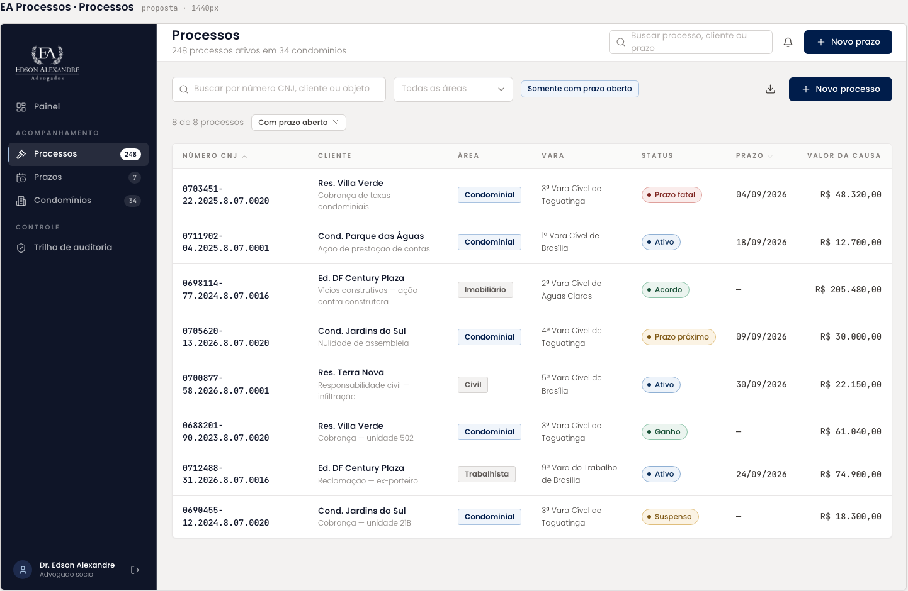

# Acordos

Listagem central do sistema de acordos, com dois diálogos: cadastro de um novo acordo e importação de inadimplentes por planilha. A listagem herdou o nó da tela de Processos; os dois diálogos são frames novos que repetem a listagem ao fundo com o `Dialog` sobre o véu.

| | |
| --- | --- |
| Origem | Listagem **editada no Figma** a partir de Processos; diálogos **criados no Figma** |
| Nós no Figma | listagem [34:5584](https://www.figma.com/design/jEwHxavSrPVQrm3hGSLGtC/edson-alexandre-advogados_design-system?node-id=34-5584) · Novo Acordo [124:55](https://www.figma.com/design/jEwHxavSrPVQrm3hGSLGtC/edson-alexandre-advogados_design-system?node-id=124-55) · Importar Inadimplentes [124:380](https://www.figma.com/design/jEwHxavSrPVQrm3hGSLGtC/edson-alexandre-advogados_design-system?node-id=124-380) |
| Fonte da tela de origem | [`ui_kits/plataforma_processos/Processos.jsx`](https://github.com/Advocondo/ui-kit/blob/main/ui_kits/plataforma_processos/Processos.jsx) |
| Componentes | `SidebarNav`, `TopBar`, `Input icon="search"`, `Select`, `Tag`, `Button`, `DataTable`, `StatusPill`, `Dialog`, `FieldLabel`, `Input mono` |
| Histórias de usuário | [US15](../historias/ep03-cadastro-acordos.md#us15), [US16](../historias/ep03-cadastro-acordos.md#us16) e [US17](../historias/ep03-cadastro-acordos.md#us17) (cadastro, honorários e parcelas) no diálogo Novo Acordo; [US14](../historias/ep03-cadastro-acordos.md#us14) (importação em lote) no diálogo Importar Inadimplentes; [US22](../historias/ep03-cadastro-acordos.md#us22) (busca e filtros) na listagem. [US13](../historias/ep03-cadastro-acordos.md#us13) (cadastrar devedor) e [US18](../historias/ep03-cadastro-acordos.md#us18) (advogado responsável) não aparecem. Ver a [cobertura das histórias](cobertura-historias.md). |

## Listagem

- Busca "Buscar por número CNJ, cliente ou unidade", filtro "Todas as áreas" e alternador "Somente com prazo aberto".
- Ações no cabeçalho: "Importar Planilha" e "Novo Acordo".
- Contador "8 de 8 processos" e a tag de filtro "Com prazo aberto".
- Colunas: Condomínio, Unidade, Valor do Acordo, Valor Honorários, Qtd. Parcelas, Dia do vencimento, Status, Processo?

| Condomínio | Unidade | Valor do Acordo | Valor Honorários | Parcelas | Vencimento | Status | Processo? |
| --- | --- | --- | --- | --- | --- | --- | --- |
| Res. Villa Verde | Bloco B | R$ 4.500,00 | R$ 450,00 | 10x | Dia 15 | Ativo | Sim |
| Cond. Parque das Águas | Torre A | R$ 1.200,00 | R$ 270,00 | 3x | Dia 05 | Concluído | Não |

## Diálogo Novo Acordo

Aberto por "Novo Acordo". A barra superior ganha o subtítulo "248 processos ativos em 34 condomínios".

| Campo | Exemplo no protótipo |
| --- | --- |
| Condomínio (obrigatório) | Residencial Mirante - 14.447.918/0001-98 |
| Unidade | 123 |
| Valor Total da Dívida | R$ 5.500,00 |
| Honorários do Escritório | R$ 550,00 |
| Quantidade de Parcelas | 10 |
| Vencimento da 1ª Parcela | 01/01/2026 |

Ações: Cancelar e Salvar.

## Diálogo Importar Inadimplentes

Aberto por "Importar Planilha".

- Condomínio (obrigatório), com o mesmo exemplo "Residencial Mirante - 14.447.918/0001-98".
- "Anexar Planilha", mostrando o arquivo `Planilha_de_inadimplentes.xlsx`.
- Link "Baixar Modelo de Planilha".
- Ações: Cancelar e Salvar.

## Tela de origem no repositório

!!! info "Capturas pendentes"

    Os três frames ainda não têm captura exportada. Exporte-os em PNG a 1x como `assets/prototipos/acordos.png`, `acordos-novo-acordo.png` e `acordos-importar-inadimplentes.png`.

## Pontos de atenção

- Os filtros são herança de Processos: "número CNJ" no placeholder, "Todas as áreas", "Somente com prazo aberto", "8 de 8 processos" e a tag "Com prazo aberto". Para acordos, o conjunto natural é condomínio, status (ativo, concluído, cancelado, em atraso) e responsável, com o contador "8 de 8 acordos".
- "Honorários do Escriotório" no diálogo tem erro de digitação.
- A coluna "Processo?" com Sim/Não é pouco legível. "Vinculado a processo", com um `Badge` quando houver número CNJ, diz a mesma coisa sem ponto de interrogação.
- "Importar Planilha" no botão e "Importar Inadimplentes" no diálogo são nomes diferentes para a mesma ação; alinhe os dois e troque "Salvar" por "Importar" no diálogo.
- Falta o estado de sucesso da importação (quantas linhas entraram, quantas falharam) e o estado vazio da listagem, que o `DataTable` já prevê com `EmptyState`.
- O valor de honorários da segunda linha (R$ 270,00 sobre R$ 1.200,00) não segue a mesma proporção da primeira (10%). Se os honorários forem percentuais, calcule no diálogo em vez de digitar.
- O diálogo Novo Acordo não tem o campo de responsável. A [US18](../historias/ep03-cadastro-acordos.md#us18) pede que a seleção mostre só usuários marcados como advogado, com histórico de reatribuição.
