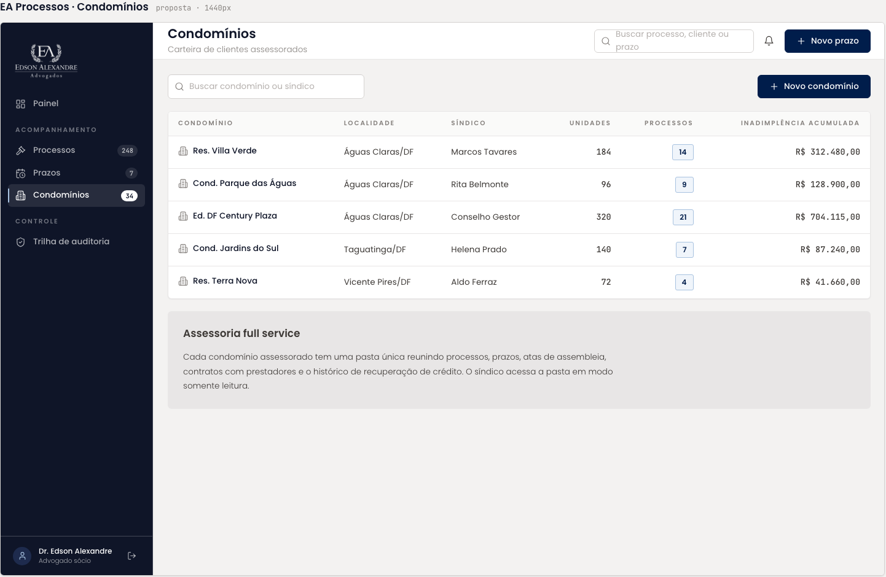

# Condomínios

Carteira de clientes: listagem dos condomínios assessorados e o diálogo de cadastro. A listagem herdou o nó da tela de Condomínios e trocou a coluna "Processos" por "Acordos Ativos"; o diálogo está em um frame novo que repete a listagem ao fundo.

| | |
| --- | --- |
| Origem | Listagem **editada no Figma**; diálogo **criado no Figma** |
| Nós no Figma | listagem [34:6276](https://www.figma.com/design/jEwHxavSrPVQrm3hGSLGtC/edson-alexandre-advogados_design-system?node-id=34-6276) · Novo condomínio [55:639](https://www.figma.com/design/jEwHxavSrPVQrm3hGSLGtC/edson-alexandre-advogados_design-system?node-id=55-639) |
| Fonte da tela de origem | [`ui_kits/plataforma_processos/Condominios.jsx`](https://github.com/Advocondo/ui-kit/blob/main/ui_kits/plataforma_processos/Condominios.jsx) |
| Componentes | `SidebarNav`, `TopBar`, `Input icon="search"`, `Button`, `DataTable`, `Dialog`, `FieldLabel`, `Input`, `Input mono` (CNPJ, CEP, telefone, datas) |
| Histórias de usuário | [US12](../historias/ep03-cadastro-acordos.md#us12) (cadastrar condomínio) e [US23](../historias/ep03-cadastro-acordos.md#us23) (renovação de contrato, só as datas no cadastro, sem sinalização na listagem). Ver a [cobertura das histórias](cobertura-historias.md). |

## Listagem

- Busca "Buscar condomínio ou síndico" e ação "Novo condomínio".
- Colunas: Condomínio, Localidade, Síndico, Unidades, Acordos Ativos, Inadimplência acumulada.

| Condomínio | Localidade | Síndico | Unidades | Acordos ativos | Inadimplência acumulada |
| --- | --- | --- | --- | --- | --- |
| Cond. Parque das Águas | Águas Claras/DF | Rita Belmonte | 96 | 9 | R$ 128.900,00 |
| Ed. DF Century Plaza | | Conselho Gestor | 320 | 21 | R$ 704.115,00 |
| Cond. Jardins do Sul | Taguatinga/DF | Helena Prado | 140 | | R$ 87.240,00 |
| Res. Terra Nova | Vicente Pires/DF | Aldo Ferraz | 72 | 4 | R$ 41.660,00 |

## Diálogo Novo condomínio

Doze campos em um único diálogo:

| Grupo | Campos (exemplo no protótipo) |
| --- | --- |
| Identificação | Nome do Condomínio (Residencial Mirante, obrigatório), CNPJ (14.447.918/0001-98) |
| Endereço | CEP (12345-678), Logradouro (Avenida 26 de Setembro), Bairro (Vicente Pires), Cidade (Brasília), Estado (DF) |
| Síndico | Nome (Lucas Gonçalves Castro), E-mail, Telefone/WhatsApp ((61) 91234-5678) |
| Contrato | Data de Início do Contrato (01/01/2026), Data de Renovação (01/01/2027) |

Ações: Cancelar e "Salvar prazo".

## Tela de origem no repositório

!!! info "Capturas pendentes"

    Os dois frames ainda não têm captura exportada. Exporte-os em PNG a 1x como `assets/prototipos/condominios.png` e `condominios-novo-condominio.png`.

## Pontos de atenção

- O botão de confirmação diz "Salvar prazo", rótulo herdado do diálogo "Novo prazo" do design system. Deve ser "Salvar condomínio".
- Os dois frames divergem: o da listagem tem a coluna "Acordos Ativos" e quatro linhas; o do diálogo ainda mostra "Processos" e inclui a linha "Res. Villa Verde". Unifique a listagem de fundo antes de apresentar.
- Um diálogo com doze campos é longo para o `Dialog` do sistema. Considere uma página própria de cadastro, ou agrupe os campos nas quatro seções acima com `SectionTitle size="sm"`.
- Em "Ed. DF Century Plaza" a localidade está vazia e "Conselho Gestor" ocupa a coluna de síndico. Se um condomínio pode ser gerido por conselho, esse é um valor válido do campo; senão, é um dado de exemplo a corrigir.
