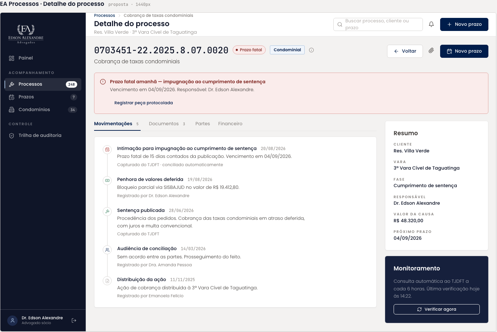

# Detalhes do Acordo

Página de um acordo: valores, progresso das parcelas, anexos e histórico. Herdou o nó da tela "Detalhe do processo" e foi reescrita para o domínio de acordos.

| | |
| --- | --- |
| Origem | **Editado no Figma** a partir de Detalhe do processo |
| Nó no Figma | [34:6543](https://www.figma.com/design/jEwHxavSrPVQrm3hGSLGtC/edson-alexandre-advogados_design-system?node-id=34-6543) |
| Fonte da tela de origem | [`ui_kits/plataforma_processos/ProcessoDetalhe.jsx`](https://github.com/Advocondo/ui-kit/blob/main/ui_kits/plataforma_processos/ProcessoDetalhe.jsx) |
| Componentes | `SidebarNav`, `TopBar` com `Breadcrumb` e ações, `MetricCard`, `Card`, barra de progresso, lista de anexos, `Timeline` |
| Histórias de usuário | [US19](../historias/ep03-cadastro-acordos.md#us19) (editar), [US20](../historias/ep03-cadastro-acordos.md#us20) (cancelar) e [US21](../historias/ep03-cadastro-acordos.md#us21) (anexos), todas só como ação no cabeçalho. Faltam o plano de parcelas da [US17](../historias/ep03-cadastro-acordos.md#us17) e a geração de PDF da [US24](../historias/ep03-cadastro-acordos.md#us24). Ver a [cobertura das histórias](cobertura-historias.md). |

## O que a tela mostra

- Cabeçalho "Detalhes do Acordo · Res. Villa Verde" com as ações Editar, Cancelar e Voltar.
- Indicadores: Dívida original R$ 4.500,00; Honorários R$ 450,00; Repasse ao condomínio R$ 4.050,00.
- Progresso: 60%, "6 de 10 parcelas pagas".
- Anexos / Documentos: `Termo_de_Confissao_Assinado;pdf`.
- Histórico, do mais recente ao mais antigo:
    - Parcela 04/10 baixada por Sarah, 20/08/2026 15:30
    - Parcela 03/10 baixada por Arthur, 19/07/2026 09:12
    - Acordo firmado e cadastrado no sistema por Dr. Alexandre, 20/05/2026 10:00

## Tela de origem no repositório

!!! info "Captura pendente"

    A versão editada ainda não tem captura exportada. Abra o [nó 34:6543](https://www.figma.com/design/jEwHxavSrPVQrm3hGSLGtC/edson-alexandre-advogados_design-system?node-id=34-6543) ou exporte o frame em PNG a 1x como `assets/prototipos/detalhes-do-acordo.png`.

## Pontos de atenção

- "rEPASSE AO cONDOMÍNIO" está com a caixa trocada; o rótulo do `MetricCard` é sobrelinha em caixa alta.
- O nome do anexo tem ponto e vírgula no lugar do ponto (`Termo_de_Confissao_Assinado;pdf`).
- O histórico mostra as parcelas 03 e 04 baixadas, mas o progresso diz 6 de 10 pagas. Alinhe os dados de exemplo.
- "Cancelar" ao lado de "Editar" é uma ação destrutiva sobre o acordo. Use `Button variant="danger"` e confirme em um `Dialog`, com o motivo do cancelamento registrado na trilha de auditoria.
- A tela de origem tinha abas (movimentações, documentos, partes, financeiro). Aqui falta a tabela das dez parcelas com vencimento, valor, situação e ação de baixa; hoje isso só existe no [Acompanhamento Mensal](acompanhamento-mensal.md).
- Falta a ação de gerar o PDF do acordo, com download e link de acesso que respeite as permissões do acordo ([US24](../historias/ep03-cadastro-acordos.md#us24)).
