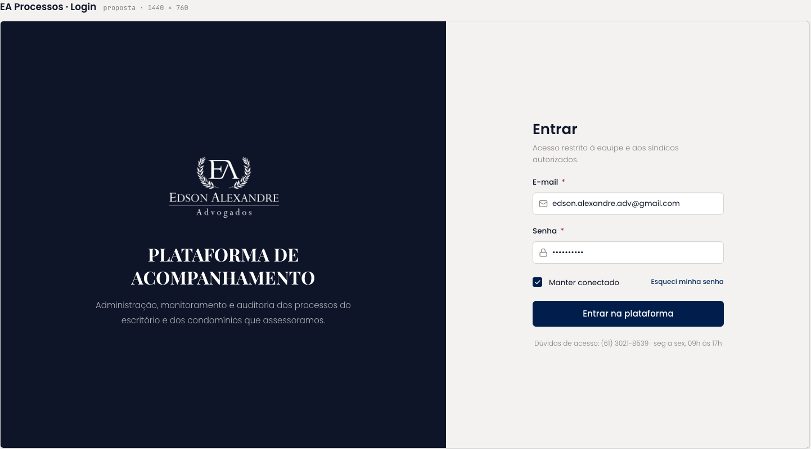

# Login

Tela de acesso à plataforma, dividida em duas metades: navy à esquerda com o lockup e a descrição "Plataforma de acompanhamento", clara à direita com o formulário.

| | |
| --- | --- |
| Origem | **Importado** da folha HTML, sem alteração |
| Nó no Figma | [34:5067](https://www.figma.com/design/jEwHxavSrPVQrm3hGSLGtC/edson-alexandre-advogados_design-system?node-id=34-5067) |
| Fonte no repositório | [`ui_kits/plataforma_processos/Login.jsx`](https://github.com/Advocondo/ui-kit/blob/main/ui_kits/plataforma_processos/Login.jsx) |
| Componentes | `Logo`, `FieldLabel`, `Input` (e-mail e senha), `Checkbox` ("Manter conectado"), `Button` (`primary`, `lg`, bloco), link "Esqueci minha senha" |
| Histórias de usuário | [US02](../historias/ep01-portal-autenticacao.md#us02) (login com e-mail e senha). O estado de erro genérico da US02-CA02 não é demonstrado. Ver a [cobertura das histórias](cobertura-historias.md). |

## O que a tela mostra

- Título "Entrar" e a frase de contexto "Acesso restrito à equipe e aos síndicos autorizados."
- Campos E-mail (obrigatório) e Senha, opção "Manter conectado" e o link "Esqueci minha senha", que leva à tela [Redefinir Senha](redefinir-senha.md).
- Ação única "Entrar na plataforma".
- Rodapé com o canal de suporte: "Dúvidas de acesso: (61) 3021-8539 · seg a sex, 09h às 17h".

## Captura

## Pontos de atenção

- Os protótipos de requisito preveem erro genérico de autenticação. A tela no Figma não mostra o estado de erro; o padrão é `Input invalid` com `error` abaixo do campo, sem revelar se o e-mail existe.
- "Síndicos autorizados" no texto de contexto sugere um perfil de cliente que não aparece em [Gestão de Usuários](gestao-de-usuarios.md). Confirme se esse perfil entra no escopo.
