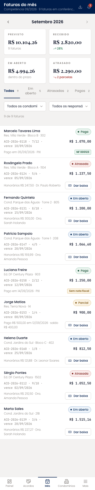
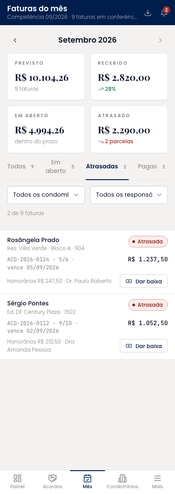
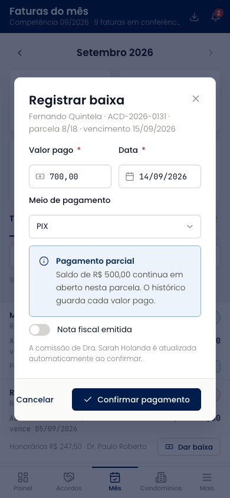
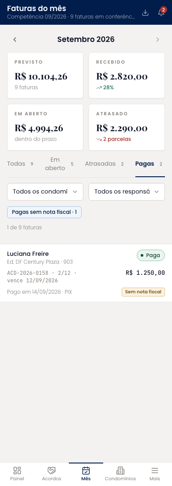

# Faturas do mês (mobile)

A tela de uso diário, chamada "Faturas do mês" como nos protótipos de requisito. Navegação por mês, quatro totais, abas por situação, filtros por condomínio e responsável e a lista de faturas com devedor, código, parcela, vencimento, valor, honorários e responsável. Cada fatura pendente tem o botão de dar baixa; as pagas mostram a nota fiscal ou o aviso de nota pendente.

| | |
| --- | --- |
| Arquivo | `prototipos/mobile/acompanhamento-mensal.html` no repositório [`Advocondo/ui-kit`](https://github.com/Advocondo/ui-kit) |
| Histórias de usuário | [US25](../../historias/ep04-parcelas.md#us25), [US26](../../historias/ep04-parcelas.md#us26), [US27](../../historias/ep04-parcelas.md#us27), [US28](../../historias/ep04-parcelas.md#us28), [US29](../../historias/ep04-parcelas.md#us29), [US35](../../historias/ep05-comissoes-metas.md#us35) |
| Estados | `?atrasadas` — aba de atrasadas selecionada `?pagas` — aba de pagas `?sem-nota` — pagas sem nota fiscal registrada `?baixa` — diálogo de baixa integral `?baixa-parcial` — diálogo com valor menor que a parcela `?exportar` — confirmação de exportação |
| Componentes do design system | `MetricCard`, `Tabs` com contadores, `Select`, `Tag`, `StatusPill`, `Button size="sm"`, `Badge`, `Dialog`, `Input mono`, `Switch`, `Alert`, `Toast`, `EmptyState` |
| Navegação | Item "Mês" da navegação inferior. O ícone de exportar fica na barra superior; a baixa abre em diálogo. |
| Versão desktop | [Faturas do mês](../acompanhamento-mensal.md) |

## Capturas

Capturas em 390px de largura, renderizadas do HTML. As telas longas aparecem inteiras; as de diálogo, na altura de um aparelho (844px).

<figure markdown="span">

<figcaption>Todas as faturas do mês</figcaption>

</figure>

<figure markdown="span">

<figcaption>Aba de atrasadas</figcaption>

</figure>

<figure markdown="span">

<figcaption>Baixa integral com nota fiscal</figcaption>

</figure>

<figure markdown="span">

<figcaption>Baixa parcial com saldo em aberto</figcaption>

</figure>

<figure markdown="span">

<figcaption>Pagas sem nota fiscal</figcaption>

</figure>

## O que muda em relação ao Figma

- O calendário com "Prazo fatal", herdado de Prazos, saiu; o mês é navegado no cabeçalho.
- "Recebedor" virou "Meio de pagamento", e os status seguem caixa de frase ("Em aberto").
- A baixa aceita valor menor que a parcela e mostra o saldo restante (US28); nota fiscal entra no mesmo diálogo (US29).
- O recorte "Pagas sem nota fiscal" atende a US29-CA02; a exportação respeita os filtros (US35).

## Premissas

- A lista mostra devedor, condomínio, valor e status, com filtros por condomínio, responsável e status (US25).
- A baixa pede valor, data e meio; valor menor que a parcela vira pagamento parcial com saldo em aberto (US26, US28).
- Atrasada é calculada pelo sistema quando o vencimento passa sem baixa (US27).
- Nota fiscal registrada na baixa; há recorte de pagas sem nota (US29).
- A exportação respeita os filtros aplicados na tela (US35).

## Pontos de atenção

- O status "Atrasada" é calculado pelo sistema; a tela só o exibe (US27).
- Estornar uma baixa fica restrito ao administrador e não aparece aqui; está na Trilha de auditoria.
