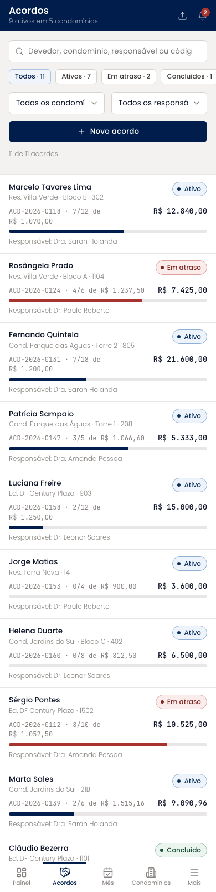
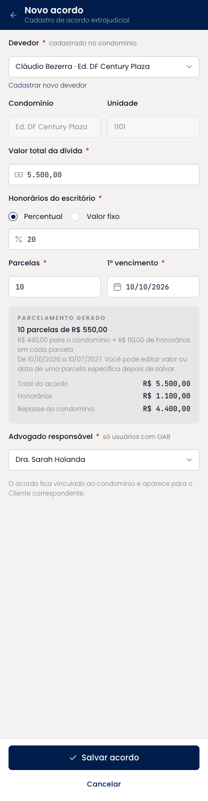
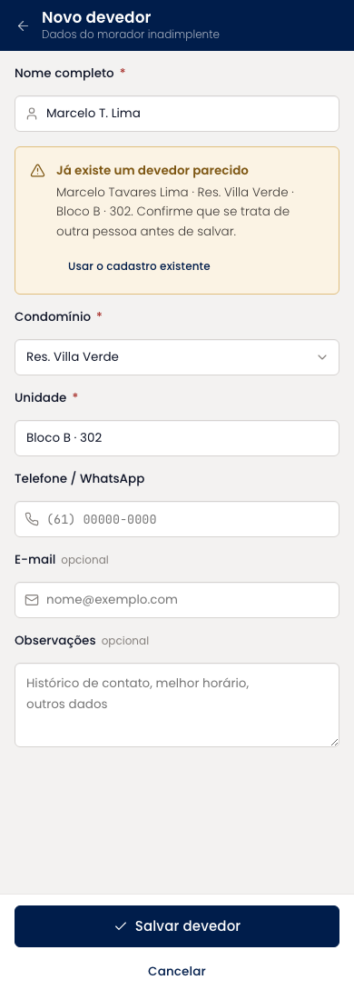
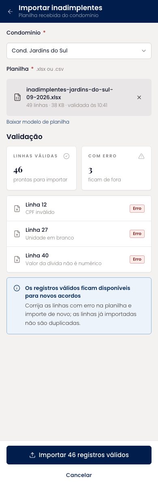
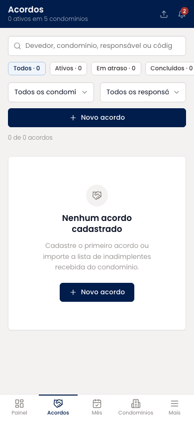

# Acordos (mobile)

A listagem central e os três formulários do cadastro. A lista traz devedor, condomínio, código, parcelas pagas e responsável, com busca por texto, chips de status e filtros por condomínio e responsável. O novo acordo pede devedor, valor, honorários, parcelas e advogado responsável, e mostra a prévia do parcelamento antes de salvar. O cadastro de devedor alerta duplicidade e a importação valida a planilha linha a linha.

| | |
| --- | --- |
| Arquivo | `prototipos/mobile/acordos.html` no repositório [`Advocondo/ui-kit`](https://github.com/Advocondo/ui-kit) |
| Histórias de usuário | [US13](../../historias/ep03-cadastro-acordos.md#us13), [US14](../../historias/ep03-cadastro-acordos.md#us14), [US15](../../historias/ep03-cadastro-acordos.md#us15), [US16](../../historias/ep03-cadastro-acordos.md#us16), [US17](../../historias/ep03-cadastro-acordos.md#us17), [US18](../../historias/ep03-cadastro-acordos.md#us18), [US22](../../historias/ep03-cadastro-acordos.md#us22) |
| Estados | `?novo-acordo` — formulário de novo acordo com prévia do parcelamento `?novo-devedor` — cadastro de devedor com alerta de duplicidade `?importar` — importação de planilha com validação das linhas `?vazio` — estado vazio da listagem `?filtro=cancelado` — listagem filtrada por status |
| Componentes do design system | `Input type="search"`, `Tag` (chips de status), `Select`, `Button`, `StatusPill`, `EmptyState`, `Card tone="sunken"` (prévia do parcelamento), `Radio`, `Alert`, `MetricCard`, `Badge` |
| Navegação | Item "Acordos" da navegação inferior. Formulários abrem em tela cheia com rodapé fixo; cada acordo leva a Detalhes do acordo. |
| Versão desktop | [Acordos](../acordos.md) |

## Capturas

Capturas em 390px de largura, renderizadas do HTML. As telas longas aparecem inteiras; as de diálogo, na altura de um aparelho (844px).

<figure markdown="span">

<figcaption>Listagem com filtros</figcaption>

</figure>

<figure markdown="span">

<figcaption>Novo acordo com prévia do parcelamento</figcaption>

</figure>

<figure markdown="span">

<figcaption>Novo devedor com alerta de duplicidade</figcaption>

</figure>

<figure markdown="span">

<figcaption>Importação de inadimplentes com validação</figcaption>

</figure>

<figure markdown="span">

<figcaption>Estado vazio</figcaption>

</figure>

## O que muda em relação ao Figma

- O devedor passa a ser a entidade central: aparece na lista, na busca, no cadastro e tem formulário próprio (US13, US15, US22).
- Os filtros herdados de Processos ("número CNJ", "Todas as áreas", "prazo aberto") foram trocados por status, condomínio e responsável.
- O responsável é escolhido entre usuários marcados como advogado (US18); o Figma não tinha o campo.
- A prévia mostra a divisão condomínio + honorários por parcela e o período do parcelamento (US16, US17).
- A importação mostra linhas válidas e com erro antes de confirmar (US14-CA01).

## Premissas

- Busca por devedor, condomínio, responsável ou código, combinável com status (US22).
- O cadastro pede devedor, condomínio, valor total, honorários, parcelas e advogado responsável; o responsável só pode ser usuário com OAB (US15, US18).
- Honorários e parcelas geram uma prévia com a divisão condomínio + honorários por parcela (US16, US17).
- A importação valida a planilha e lista as linhas com erro antes de confirmar (US14).

## Pontos de atenção

- Os formulários longos abrem em tela cheia, não em diálogo, para caber teclado e rolagem.
- A edição de uma parcela específica (US17-CA03) ainda é só um botão; falta o formulário.
