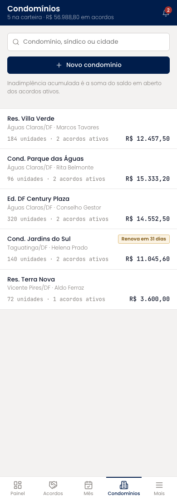
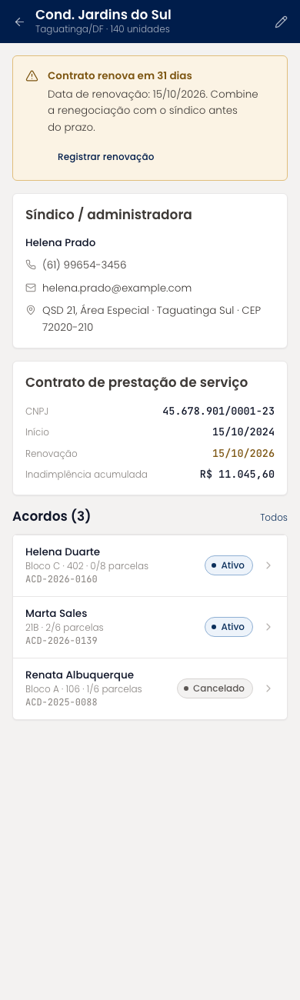
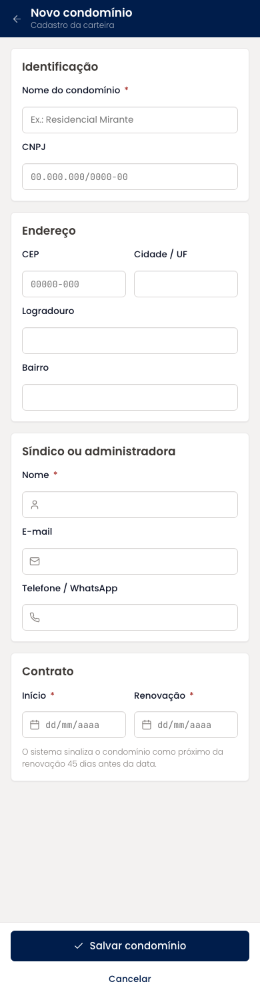
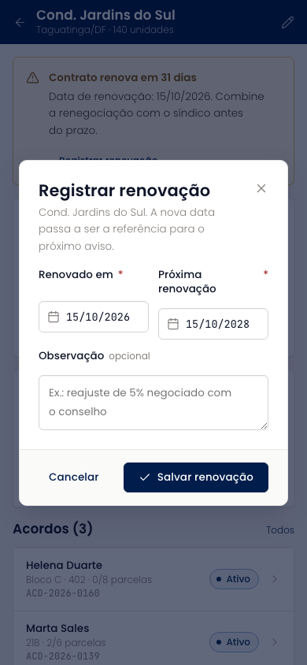

# Condomínios (mobile)

A carteira de condomínios com busca, o detalhe de cada um (síndico ou administradora, contrato, acordos vinculados) e o cadastro em quatro grupos: identificação, endereço, síndico e contrato. Um condomínio a 45 dias da renovação recebe a etiqueta na lista e um aviso no detalhe, com o registro da renovação em diálogo.

| | |
| --- | --- |
| Arquivo | `prototipos/mobile/condominios.html` no repositório [`Advocondo/ui-kit`](https://github.com/Advocondo/ui-kit) |
| Histórias de usuário | [US12](../../historias/ep03-cadastro-acordos.md#us12), [US23](../../historias/ep03-cadastro-acordos.md#us23) |
| Estados | `?detalhe&id=jardins-sul` — detalhe do condomínio com contrato próximo da renovação `?novo` — cadastro em quatro grupos `?editar&id=villa-verde` — edição de um condomínio `?renovacao&id=jardins-sul` — diálogo de registro da renovação |
| Componentes do design system | `Input type="search"`, `Badge tone="warn"`, `Card`, `Alert`, `StatusPill`, `Dialog`, `Input mono`, `Textarea`, `Toast` |
| Navegação | Item "Condomínios" da navegação inferior. Cada condomínio abre o detalhe; o lápis na barra superior abre a edição. |
| Versão desktop | [Condomínios](../condominios.md) |

## Capturas

Capturas em 390px de largura, renderizadas do HTML. As telas longas aparecem inteiras; as de diálogo, na altura de um aparelho (844px).

<figure markdown="span">

<figcaption>Carteira com sinalização de renovação</figcaption>

</figure>

<figure markdown="span">

<figcaption>Detalhe do Cond. Jardins do Sul</figcaption>

</figure>

<figure markdown="span">

<figcaption>Cadastro em quatro grupos</figcaption>

</figure>

<figure markdown="span">

<figcaption>Registro da renovação</figcaption>

</figure>

## O que muda em relação ao Figma

- O formulário de doze campos, que no Figma era um único diálogo, virou tela cheia com quatro grupos e o botão "Salvar condomínio" (não mais "Salvar prazo").
- A sinalização de renovação próxima e o registro da renovação cobrem a US23, que o Figma só atendia com as datas no cadastro.
- A lista mostra "acordos ativos" em vez de "processos".

## Premissas

- Cadastro com nome, endereço, síndico ou administradora e datas do contrato (US12).
- Condomínio a 45 dias da renovação recebe sinalização na lista e no detalhe; a renovação registrada atualiza a próxima data (US23).
- Condomínio pode ser editado depois (US12-CA02).

## Pontos de atenção

- O prazo de 45 dias para o aviso é uma premissa; ajuste conforme a rotina de renegociação.
- A inadimplência acumulada por condomínio é ilustrativa.
