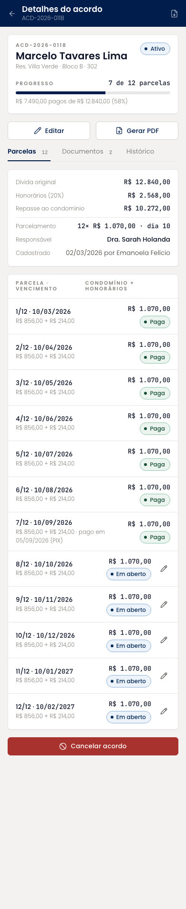
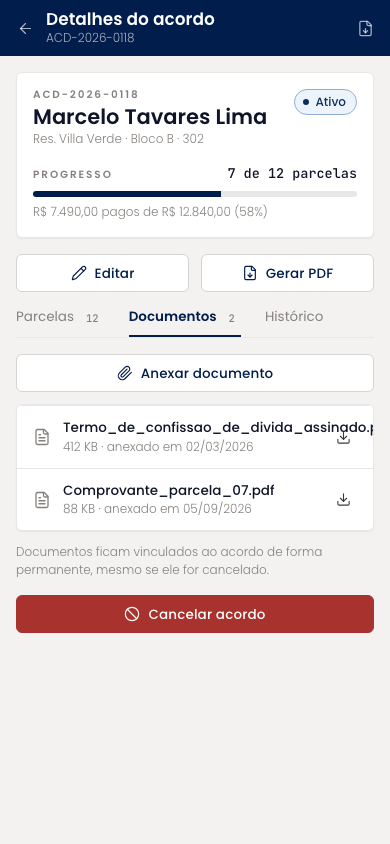
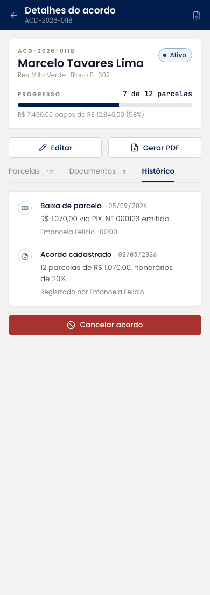
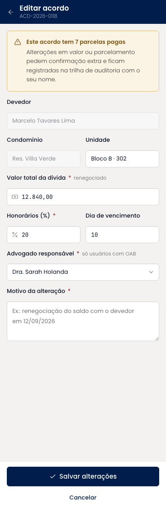
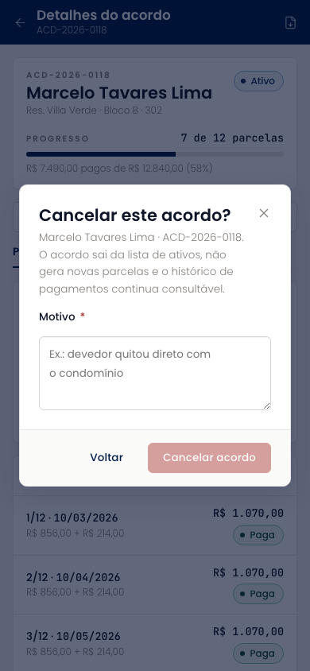
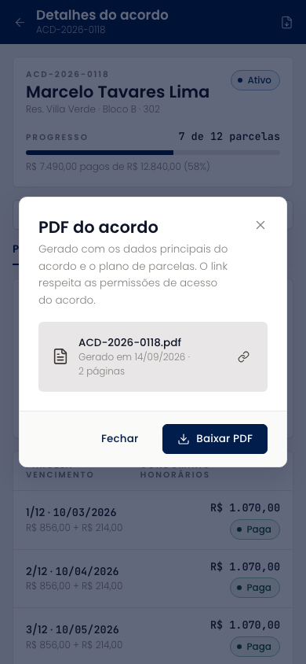

# Detalhes do acordo (mobile)

Página do acordo com o resumo financeiro, o progresso e três abas: parcelas, documentos e histórico. A tabela de parcelas mostra vencimento, valor e a divisão entre condomínio e honorários de cada uma, com o status e a data de pagamento das já baixadas. As ações de editar, gerar PDF e cancelar ficam na própria tela.

| | |
| --- | --- |
| Arquivo | `prototipos/mobile/detalhes-do-acordo.html` no repositório [`Advocondo/ui-kit`](https://github.com/Advocondo/ui-kit) |
| Histórias de usuário | [US16](../../historias/ep03-cadastro-acordos.md#us16), [US17](../../historias/ep03-cadastro-acordos.md#us17), [US19](../../historias/ep03-cadastro-acordos.md#us19), [US20](../../historias/ep03-cadastro-acordos.md#us20), [US21](../../historias/ep03-cadastro-acordos.md#us21), [US24](../../historias/ep03-cadastro-acordos.md#us24), [US31](../../historias/ep04-parcelas.md#us31) |
| Estados | `?documentos` — aba de documentos anexados `?historico` — aba de histórico do acordo `?editar` — formulário de edição com aviso de parcelas pagas `?cancelar` — diálogo de cancelamento com motivo `?pdf` — diálogo do PDF gerado `?salvo` — retorno da edição com confirmação `?id=ACD-2026-0124` — outro acordo (em atraso) |
| Componentes do design system | `Card`, `StatusPill`, `Tabs`, `Timeline`, `EmptyState`, `Dialog`, `Textarea`, `Button variant="danger"`, `IconButton`, `Toast` |
| Navegação | Aberta a partir da lista de Acordos ou do detalhe do condomínio. Editar abre em tela cheia; cancelar e PDF abrem em diálogo. |
| Versão desktop | [Detalhes do acordo](../detalhes-do-acordo.md) |

## Capturas

Capturas em 390px de largura, renderizadas do HTML. As telas longas aparecem inteiras; as de diálogo, na altura de um aparelho (844px).

<figure markdown="span">

<figcaption>Resumo e plano de parcelas</figcaption>

</figure>

<figure markdown="span">

<figcaption>Aba de documentos</figcaption>

</figure>

<figure markdown="span">

<figcaption>Aba de histórico</figcaption>

</figure>

<figure markdown="span">

<figcaption>Edição com aviso de parcelas pagas</figcaption>

</figure>

<figure markdown="span">

<figcaption>Cancelamento com motivo obrigatório</figcaption>

</figure>

<figure markdown="span">

<figcaption>PDF gerado, com download e link</figcaption>

</figure>

## O que muda em relação ao Figma

- O plano de parcelas, que não existia no Figma, é o centro da tela (US17) e traz a divisão por parcela (US16).
- Cancelar usa `variant="danger"`, exige motivo e explica que o histórico permanece (US20).
- Editar um acordo com parcelas pagas mostra aviso e pede motivo (US19).
- A geração de PDF, com download e link que respeita as permissões do acordo, cobre a US24.

## Premissas

- A tabela de parcelas mostra vencimento, valor e a divisão condomínio + honorários de cada parcela (US16, US17).
- Parcelas em aberto podem ser editadas uma a uma (US17-CA03).
- Editar um acordo com parcelas pagas exibe aviso e pede motivo (US19).
- Cancelar exige motivo, mantém o histórico e tira o acordo dos ativos (US20).
- O PDF fica disponível para download e por link com as mesmas permissões do acordo (US24).

## Pontos de atenção

- O upload de documento é só um botão; o fluxo de anexar (câmera, arquivos) fica para a implementação (US21).
- O acordo exibido por padrão é o ACD-2026-0118; `?id=ACD-2026-0124` mostra um acordo em atraso.
