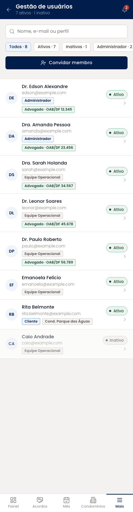
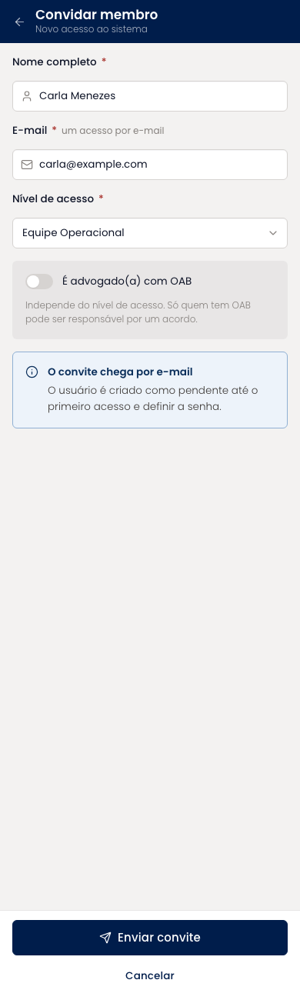
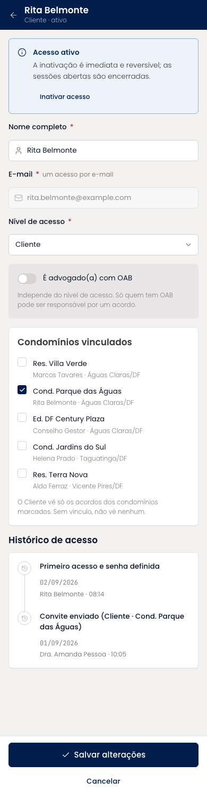
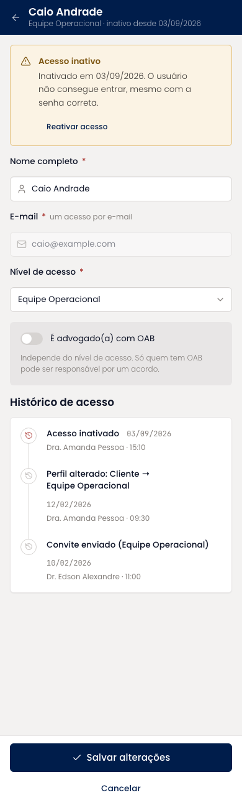
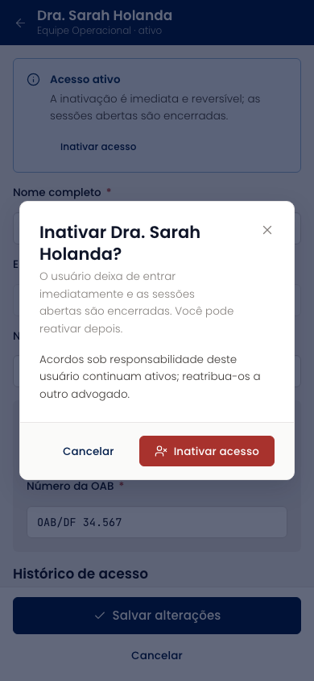

# Gestão de usuários (mobile)

Listagem dos usuários com perfil, marcação de advogado com OAB, condomínios vinculados e status. O convite pede nome, e-mail, nível de acesso e a marcação de advogado; para o perfil Cliente, a lista de condomínios a vincular. A edição reúne a mesma forma, o bloco de inativar ou reativar e o histórico de acesso da pessoa.

| | |
| --- | --- |
| Arquivo | `prototipos/mobile/gestao-de-usuarios.html` no repositório [`Advocondo/ui-kit`](https://github.com/Advocondo/ui-kit) |
| Histórias de usuário | [US07](../../historias/ep02-usuarios-perfis.md#us07), [US08](../../historias/ep02-usuarios-perfis.md#us08), [US09](../../historias/ep02-usuarios-perfis.md#us09), [US10](../../historias/ep02-usuarios-perfis.md#us10), [US11](../../historias/ep02-usuarios-perfis.md#us11) |
| Estados | `?perfil=admin` — listagem `?convidar&perfil=admin` — formulário de convite `?editar&id=u7&perfil=admin` — edição de um Cliente com condomínios vinculados `?editar&id=u8&perfil=admin` — usuário inativo com reativação `?inativar&id=u3&perfil=admin` — diálogo de inativação |
| Componentes do design system | `Input type="search"`, `Tag`, `Badge`, `StatusPill`, `Select`, `Switch`, `Checkbox` com descrição, `Card tone="sunken"`, `Alert`, `Timeline`, `Dialog`, `Button variant="danger"`, `Toast` |
| Navegação | Só pelo menu Mais do administrador. Convidar e editar abrem em tela cheia; inativar abre em diálogo. |
| Versão desktop | [Gestão de usuários](../gestao-de-usuarios.md) |

## Capturas

Capturas em 390px de largura, renderizadas do HTML. As telas longas aparecem inteiras; as de diálogo, na altura de um aparelho (844px).

<figure markdown="span">

<figcaption>Listagem com filtros</figcaption>

</figure>

<figure markdown="span">

<figcaption>Convite de membro</figcaption>

</figure>

<figure markdown="span">

<figcaption>Cliente com condomínios vinculados e histórico</figcaption>

</figure>

<figure markdown="span">

<figcaption>Usuário inativo com reativação</figcaption>

</figure>

<figure markdown="span">

<figcaption>Confirmação de inativação</figcaption>

</figure>

## O que muda em relação ao Figma

- Inativar e reativar, que faltavam no Figma, cobrem a US08; o botão de salvar diz "Salvar alterações", não "Salvar prazo".
- A marcação de advogado com OAB, independente do perfil, cobre a US07-CA04 e alimenta o responsável do acordo.
- O perfil Cliente existe e é vinculado a condomínios (US10).
- O histórico por usuário cobre a US11.

## Premissas

- Convite com e-mail e nível de acesso; e-mail único (US07).
- Marcação de advogado com OAB independente do perfil (US07-CA04).
- Cliente vinculado a um ou mais condomínios (US10).
- Inativar é imediato e reversível (US08); histórico por usuário (US11).

## Pontos de atenção

- Números de OAB e e-mails são fictícios.
- Ao inativar alguém com acordos sob responsabilidade, o diálogo lembra de reatribuir; a reatribuição em lote não foi desenhada.
