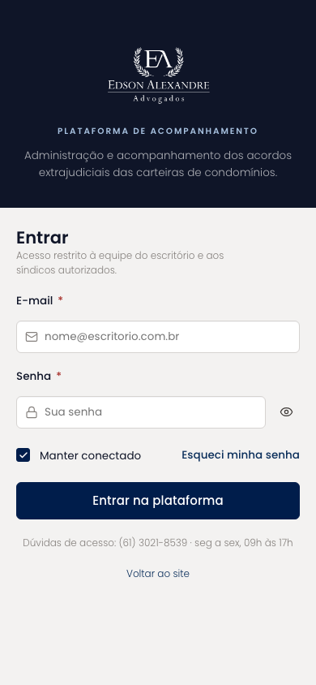
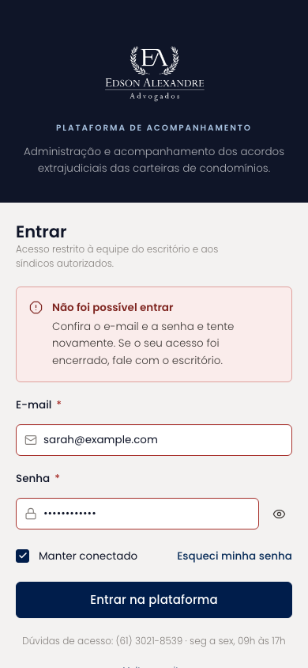

# Login (mobile)

Acesso à plataforma com e-mail e senha. A metade navy do desktop vira um cabeçalho com o lockup e a descrição da plataforma; o formulário ocupa o resto da tela, com o botão de entrar em largura total.

| | |
| --- | --- |
| Arquivo | `prototipos/mobile/login.html` no repositório [`Advocondo/ui-kit`](https://github.com/Advocondo/ui-kit) |
| Histórias de usuário | [US02](../../historias/ep01-portal-autenticacao.md#us02) |
| Estados | `?erro` — credenciais inválidas, mensagem genérica |
| Componentes do design system | `Logo`, `FieldLabel`, `Input` (e-mail e senha), `IconButton` (mostrar senha), `Checkbox`, `Button`, `Alert tone="risk"` |
| Navegação | Tela de acesso. "Esqueci minha senha" leva a Redefinir senha; "Voltar ao site" leva à landing. |
| Versão desktop | [Login](../login.md) |

## Capturas

Capturas em 390px de largura, renderizadas do HTML. As telas longas aparecem inteiras; as de diálogo, na altura de um aparelho (844px).

<figure markdown="span">

<figcaption>Estado padrão</figcaption>

</figure>

<figure markdown="span">

<figcaption>Credenciais inválidas: mensagem genérica, campos marcados</figcaption>

</figure>

## O que muda em relação ao Figma

- O estado de erro, ausente no Figma, mostra um `Alert` genérico sem indicar qual campo errou, como pede a US02-CA02. Um usuário inativado recebe a mesma mensagem.
- O campo de senha ganhou o alternador de visibilidade, conveniente no teclado do celular.

## Premissas

- Mensagem de erro genérica, sem indicar qual campo errou (US02-CA02).
- Usuário inativado recebe a mesma mensagem (US02-CA03).

## Pontos de atenção

- "Manter conectado" está ligado por padrão; confirme se isso vale para o perfil Cliente, que usa aparelhos fora do escritório.
