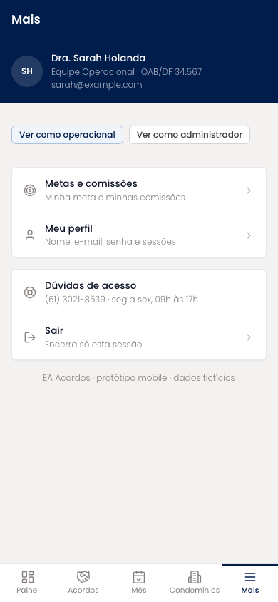
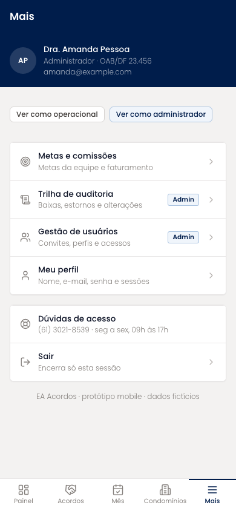

# Mais (mobile)

Menu secundário: identidade do usuário, atalhos para Metas e comissões, Trilha de auditoria, Gestão de usuários e Perfil, suporte e saída. Trilha e Gestão só aparecem para o administrador.

| | |
| --- | --- |
| Arquivo | `prototipos/mobile/mais.html` no repositório [`Advocondo/ui-kit`](https://github.com/Advocondo/ui-kit) |
| Histórias de usuário | [US07](../../historias/ep02-usuarios-perfis.md#us07), [US11](../../historias/ep02-usuarios-perfis.md#us11), [US32](../../historias/ep05-comissoes-metas.md#us32) |
| Estados | `?perfil=admin` — itens exclusivos do administrador visíveis |
| Componentes do design system | `Card padding="none"`, `Badge`, `Tag` (troca de perfil para demonstração), `Icon` |
| Navegação | Quinto item da navegação inferior. Agrupa o que não cabe nos quatro itens principais. |
| Versão desktop | não há; a tela é específica do mobile |

## Capturas

Capturas em 390px de largura, renderizadas do HTML. As telas longas aparecem inteiras; as de diálogo, na altura de um aparelho (844px).

<figure markdown="span">

<figcaption>Menu do perfil operacional</figcaption>

</figure>

<figure markdown="span">

<figcaption>Menu do administrador, com os itens restritos</figcaption>

</figure>

## O que muda em relação ao Figma

- Não existe no Figma. Substitui a barra lateral de 248px, que não cabe no celular.

## Premissas

- Trilha de auditoria e Gestão de usuários aparecem só para o administrador (US07-CA02, US11-CA02).
- A troca de perfil é um recurso de demonstração do protótipo, não do produto.

## Pontos de atenção

- As duas etiquetas "Ver como operacional / administrador" são um recurso de demonstração do protótipo; não entram no produto.
