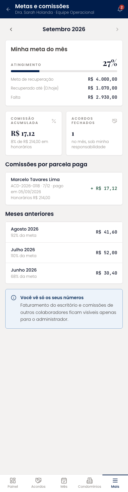
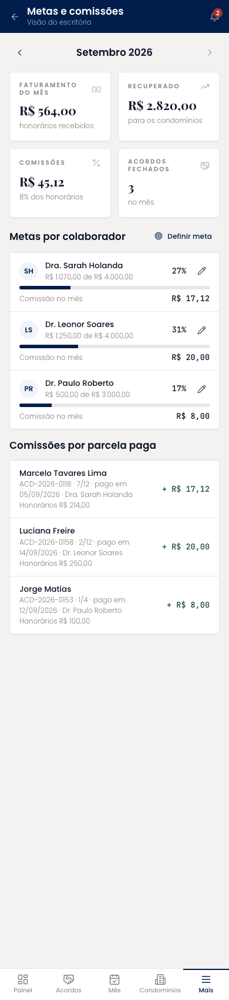
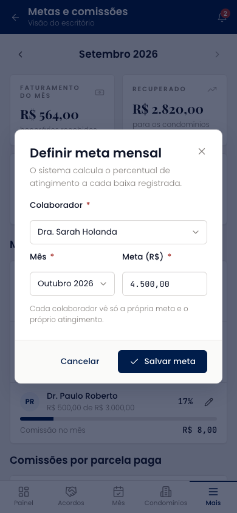

# Metas e comissões (mobile)

Duas visões no mesmo arquivo. O colaborador vê a própria meta com atingimento, a comissão acumulada, as comissões por parcela paga e os meses anteriores, com o aviso de que não vê os números dos colegas. O administrador vê faturamento, recuperado, comissões e acordos fechados do escritório, as metas por colaborador com edição, e todas as comissões do mês.

| | |
| --- | --- |
| Arquivo | `prototipos/mobile/metas-e-comissoes.html` no repositório [`Advocondo/ui-kit`](https://github.com/Advocondo/ui-kit) |
| Histórias de usuário | [US32](../../historias/ep05-comissoes-metas.md#us32), [US33](../../historias/ep05-comissoes-metas.md#us33), [US36](../../historias/ep05-comissoes-metas.md#us36) |
| Estados | `?perfil=admin` — faturamento, comissões da equipe e metas por colaborador `?definir-meta&perfil=admin` — diálogo de definição de meta |
| Componentes do design system | `MetricCard`, `Card`, `Progress` (barra inline), `Alert`, `EmptyState`, `Dialog`, `Select`, `Input mono`, `IconButton`, `Toast` |
| Navegação | Acessível pelo menu Mais e pelo card de meta do Painel. A visão muda com `?perfil=admin`. |
| Versão desktop | [Metas e comissões](../metas-e-comissoes.md) |

## Capturas

Capturas em 390px de largura, renderizadas do HTML. As telas longas aparecem inteiras; as de diálogo, na altura de um aparelho (844px).

<figure markdown="span">

<figcaption>Visão do colaborador</figcaption>

</figure>

<figure markdown="span">

<figcaption>Visão do escritório com metas por colaborador</figcaption>

</figure>

<figure markdown="span">

<figcaption>Definição de meta mensal</figcaption>

</figure>

## O que muda em relação ao Figma

- Separa o que a US32 e a US33 mandam separar: colaborador só vê o próprio, administrador vê tudo.
- A definição de meta por colaborador, ausente no Figma, cobre a US36.
- "Acordos fechados" corrigido; o calendário de prazos herdado saiu.

## Premissas

- Operacional vê só a própria meta, atingimento e comissões (US32).
- Administrador vê faturamento consolidado e comissões individuais (US33) e define metas por colaborador (US36).
- Comissão de 8% sobre os honorários recebidos; regra ilustrativa, a confirmar com o escritório.

## Pontos de atenção

- A comissão de 8% sobre os honorários recebidos e as metas em reais são regras ilustrativas; confirme com o escritório.
- Só usuários marcados como advogado têm meta, porque a comissão vem do acordo sob responsabilidade.
