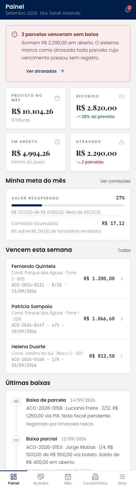
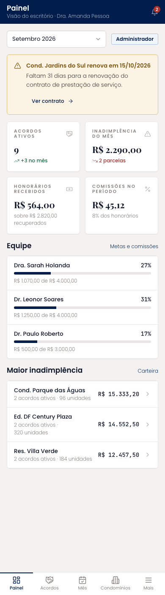
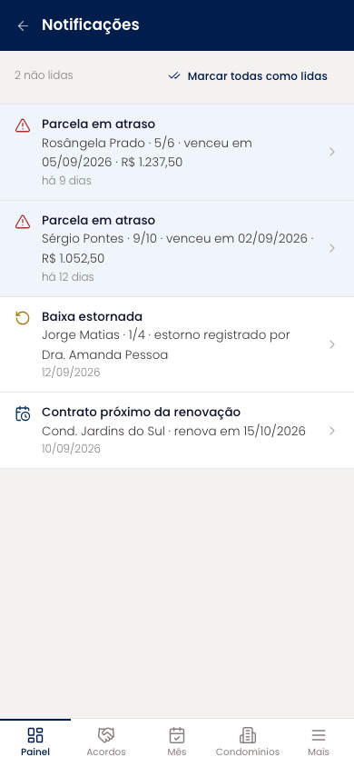

# Painel (mobile)

Entrada da plataforma, com duas visões pelo mesmo arquivo. A operacional mostra os totais do mês (previsto, recebido, em aberto, atrasado), a meta e a comissão da própria pessoa, as parcelas que vencem na semana e as últimas baixas. A do administrador troca os indicadores por acordos ativos, inadimplência, honorários e comissões, com filtro de período, a equipe e os condomínios de maior inadimplência.

| | |
| --- | --- |
| Arquivo | `prototipos/mobile/painel.html` no repositório [`Advocondo/ui-kit`](https://github.com/Advocondo/ui-kit) |
| Histórias de usuário | [US30](../../historias/ep04-parcelas.md#us30), [US32](../../historias/ep05-comissoes-metas.md#us32), [US34](../../historias/ep05-comissoes-metas.md#us34) |
| Estados | `?notificacoes` — central de notificações do sino `?perfil=admin` — visão do administrador com indicadores e filtro de período |
| Componentes do design system | `MetricCard` (compacto), `Alert`, `Card`, `Timeline`, `Select` (período), `Badge`, `IconButton` (sino) |
| Navegação | Item "Painel" da navegação inferior. O sino abre a central de notificações. |
| Versão desktop | [Painel](../painel.md) |

## Capturas

Capturas em 390px de largura, renderizadas do HTML. As telas longas aparecem inteiras; as de diálogo, na altura de um aparelho (844px).

<figure markdown="span">

<figcaption>Visão operacional (Dra. Sarah Holanda)</figcaption>

</figure>

<figure markdown="span">

<figcaption>Visão do administrador com filtro de período</figcaption>

</figure>

<figure markdown="span">

<figcaption>Central de notificações</figcaption>

</figure>

## O que muda em relação ao Figma

- Os blocos "Prazos mais próximos" e "Movimentações de hoje", herdados da EA Processos, deram lugar a "Vencem esta semana" e "Últimas baixas".
- O rótulo e o valor dos indicadores seguem o formato da marca: sobrelinha em caixa alta e `R$ 10.104,26` com espaço.
- O sino tem contador de não lidas e uma central própria, que faltava no Figma (US30).

## Premissas

- Operacional vê os totais do mês (valores recuperados para os condomínios) e só a própria meta e comissão (US32).
- Administrador vê honorários, comissões e a equipe (US34), com filtro por período.
- O sino leva à central de notificações; parcelas em atraso geram notificação (US30).

## Pontos de atenção

- A operacional vê os totais recuperados do mês inteiro, não só os seus. Se o escritório considerar esse número sensível, restrinja aos acordos da pessoa.
