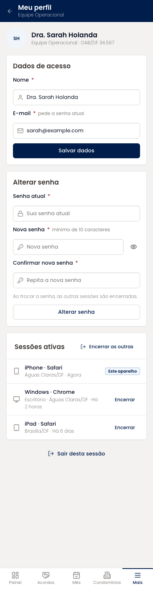
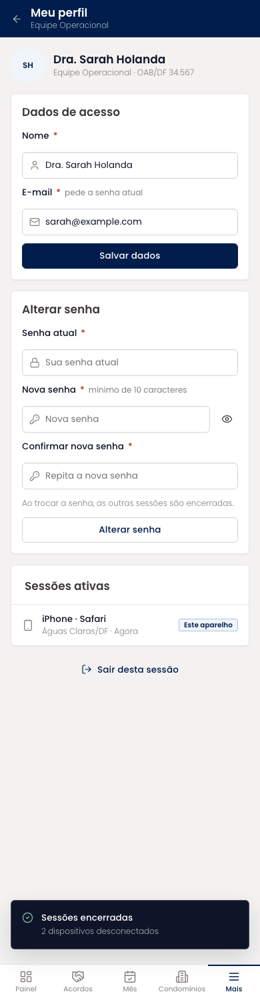

# Meu perfil (mobile)

Dados de acesso da própria pessoa, troca de senha com senha atual e confirmação, e a lista de sessões ativas com encerramento individual ou de todas as outras.

| | |
| --- | --- |
| Arquivo | `prototipos/mobile/perfil.html` no repositório [`Advocondo/ui-kit`](https://github.com/Advocondo/ui-kit) |
| Histórias de usuário | [US05](../../historias/ep01-portal-autenticacao.md#us05), [US06](../../historias/ep01-portal-autenticacao.md#us06) |
| Estados | `?salvo` — confirmação após salvar `?sessoes-encerradas` — outras sessões encerradas |
| Componentes do design system | `Card`, `FieldLabel`, `Input`, `IconButton`, `Button`, `Badge`, `Toast` |
| Navegação | Pelo menu Mais. Volta para o menu. |
| Versão desktop | [Meu perfil](../perfil.md) |

## Capturas

Capturas em 390px de largura, renderizadas do HTML. As telas longas aparecem inteiras; as de diálogo, na altura de um aparelho (844px).

<figure markdown="span">

<figcaption>Dados, senha e sessões</figcaption>

</figure>

<figure markdown="span">

<figcaption>Depois de encerrar as outras sessões</figcaption>

</figure>

## O que muda em relação ao Figma

- A ordem dos campos de senha foi corrigida (atual, nova, confirmação) e a troca de senha ficou separada dos dados cadastrais (US05).
- O bloco de sessões ativas cobre a US06, que não tinha tela.

## Premissas

- Troca de e-mail ou senha exige a senha atual (US05-CA02).
- Sessões ativas podem ser encerradas uma a uma ou todas de uma vez (US06).

## Pontos de atenção

- O perfil de acesso não é editável aqui; muda só em Gestão de usuários.
