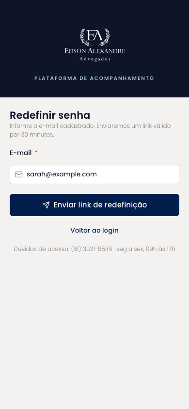
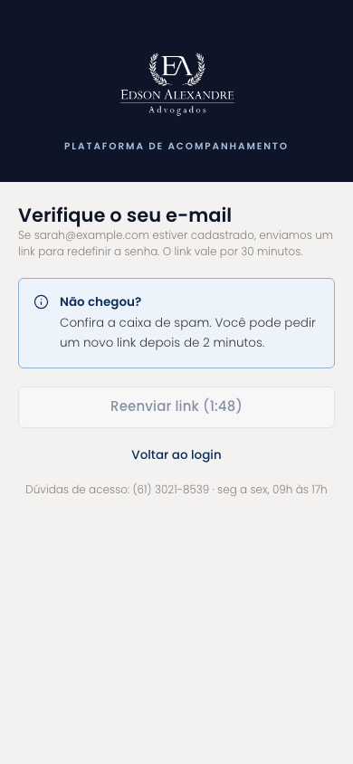
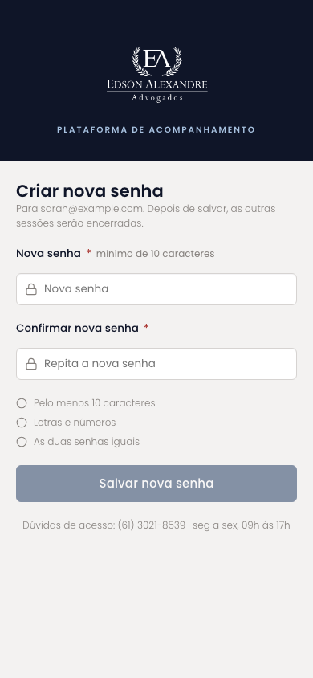
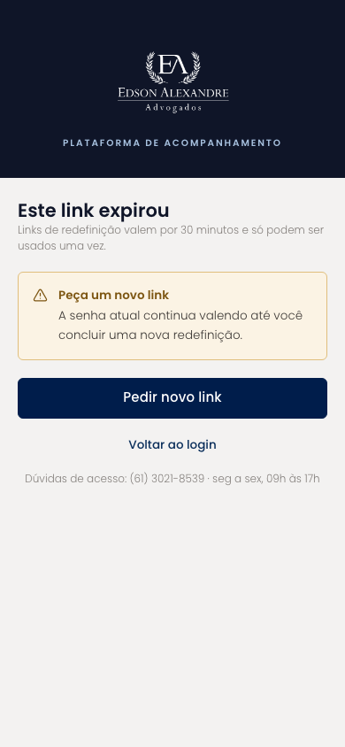
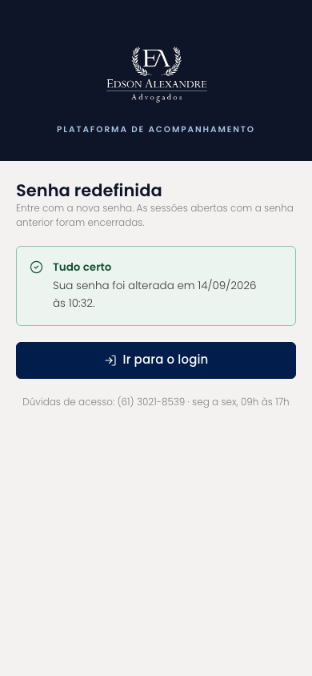

# Redefinir senha (mobile)

O fluxo completo de recuperação de senha, e não só o passo final que existia no Figma: solicitação por e-mail, confirmação de envio com reenvio bloqueado por dois minutos, criação da nova senha com critérios verificados ao digitar, link expirado e sucesso.

| | |
| --- | --- |
| Arquivo | `prototipos/mobile/redefinir-senha.html` no repositório [`Advocondo/ui-kit`](https://github.com/Advocondo/ui-kit) |
| Histórias de usuário | [US03](../../historias/ep01-portal-autenticacao.md#us03) |
| Estados | `?enviado` — link enviado, aguardando e-mail `?nova-senha` — criação da nova senha a partir do link `?expirado` — link vencido `?sucesso` — senha alterada |
| Componentes do design system | `Logo`, `FieldLabel`, `Input type="password"`, `Button`, `Alert`, `Icon` (lista de critérios) |
| Navegação | Fluxo em cinco telas ligadas por `?estado=`; todas voltam ao Login. |
| Versão desktop | [Redefinir senha](../redefinir-senha.md) |

## Capturas

Capturas em 390px de largura, renderizadas do HTML. As telas longas aparecem inteiras; as de diálogo, na altura de um aparelho (844px).

<figure markdown="span">

<figcaption>Solicitação por e-mail</figcaption>

</figure>

<figure markdown="span">

<figcaption>Link enviado</figcaption>

</figure>

<figure markdown="span">

<figcaption>Nova senha com critérios</figcaption>

</figure>

<figure markdown="span">

<figcaption>Link expirado</figcaption>

</figure>

<figure markdown="span">

<figcaption>Senha redefinida</figcaption>

</figure>

## O que muda em relação ao Figma

- Cobre os três critérios da US03: link com validade de 30 minutos, link expirado bloqueado e encerramento das sessões antigas depois da troca.
- A confirmação de envio não revela se o e-mail existe ("se estiver cadastrado, enviamos").

## Premissas

- Link válido por 30 minutos e de uso único (US03-CA01, CA02).
- Sessões antigas encerradas após redefinir (US03-CA03).
- Critérios de senha exibidos como lista de verificação.

## Pontos de atenção

- Os critérios de senha (10 caracteres, letras e números) são uma proposta; alinhe com a política do escritório.
