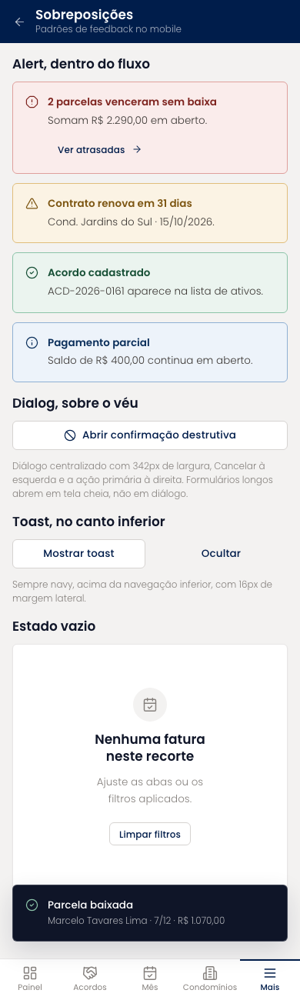
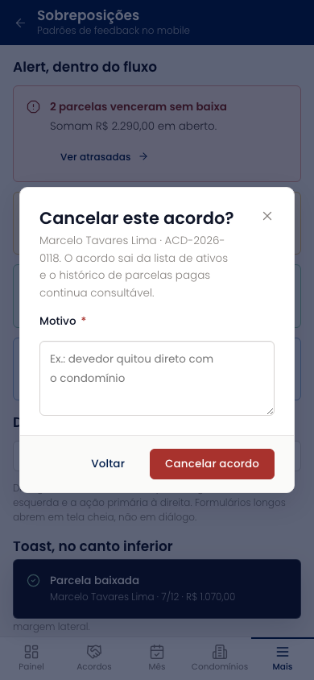

# Sobreposições (mobile)

Referência dos padrões de feedback no celular: os quatro tons de `Alert` no fluxo da tela, o `Dialog` de confirmação destrutiva com motivo, o `Toast` acima da navegação inferior e o estado vazio dentro de um card.

| | |
| --- | --- |
| Arquivo | `prototipos/mobile/sobreposicoes.html` no repositório [`Advocondo/ui-kit`](https://github.com/Advocondo/ui-kit) |
| Histórias de usuário | nenhuma; referência de padrões |
| Estados | `?dialogo` — diálogo de confirmação aberto `?sem-toast` — sem toast visível |
| Componentes do design system | `Alert` (quatro tons), `Dialog`, `Toast`, `EmptyState`, `Button` |
| Navegação | Referência de padrões, acessível só pela URL. |
| Versão desktop | [Sobreposições](../sobreposicoes.md) |

## Capturas

Capturas em 390px de largura, renderizadas do HTML. As telas longas aparecem inteiras; as de diálogo, na altura de um aparelho (844px).

<figure markdown="span">

<figcaption>Alertas, toast e estado vazio</figcaption>

</figure>

<figure markdown="span">

<figcaption>Diálogo de confirmação aberto</figcaption>

</figure>

## O que muda em relação ao Figma

- Substitui a tela "Sobreposições" do Figma, que era a tela de Prazos com um diálogo por cima.
- Fixa a regra: diálogo só para confirmação curta; formulário longo abre em tela cheia.

## Premissas

- Diálogo só para confirmações curtas; formulários longos abrem em tela cheia.
- Toast acima da navegação inferior, sempre navy.

## Pontos de atenção

- O `Dialog` centraliza na viewport com 24px de margem; um padrão de folha inferior (bottom sheet) seria mais natural no celular e é uma proposta para o design system.
