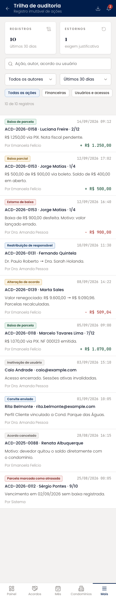
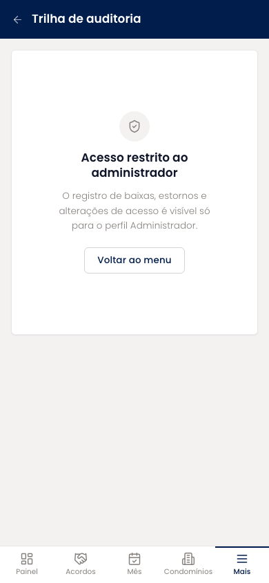

# Trilha de auditoria (mobile)

Registro imutável de baixas, baixas parciais, estornos, alterações de acordo, cancelamentos, convites e inativações. Cada registro traz a ação, data e hora, o alvo, o detalhe, o autor e, quando há, o valor movimentado com sinal. Filtros por autor, período e tipo de ação, mais busca livre e exportação.

| | |
| --- | --- |
| Arquivo | `prototipos/mobile/trilha-de-auditoria.html` no repositório [`Advocondo/ui-kit`](https://github.com/Advocondo/ui-kit) |
| Histórias de usuário | [US11](../../historias/ep02-usuarios-perfis.md#us11), [US19](../../historias/ep03-cadastro-acordos.md#us19), [US31](../../historias/ep04-parcelas.md#us31) |
| Estados | `?perfil=admin` — trilha completa `?tipo=financeiro&perfil=admin` — só ações financeiras `?tipo=usuarios&perfil=admin` — só ações de usuários e acessos |
| Componentes do design system | `MetricCard`, `Input type="search"`, `Select`, `Tag`, `Badge`, `EmptyState`, `IconButton` (exportar), `Toast` |
| Navegação | Só pelo menu Mais do administrador. Sem `?perfil=admin`, a tela mostra o acesso restrito. |
| Versão desktop | [Trilha de auditoria](../trilha-de-auditoria.md) |

## Capturas

Capturas em 390px de largura, renderizadas do HTML. As telas longas aparecem inteiras; as de diálogo, na altura de um aparelho (844px).

<figure markdown="span">

<figcaption>Trilha completa do administrador</figcaption>

</figure>

<figure markdown="span">

<figcaption>Acesso restrito para outros perfis</figcaption>

</figure>

## O que muda em relação ao Figma

- O valor alterado ganha coluna própria, com sinal, como pede a US31-CA01.
- Ações automáticas aparecem com autor "Sistema"; baixas manuais sempre têm uma pessoa.
- A restrição ao administrador está na própria tela (US31-CA02, US11-CA02).

## Premissas

- Sem o perfil Administrador a tela mostra acesso restrito (US31-CA02, US11-CA02).
- Cada registro traz autor, data e hora, alvo, detalhe e, quando há, o valor alterado (US31-CA01).
- Ações automáticas do sistema aparecem com autor Sistema.

## Pontos de atenção

- O card "Regras de auditoria vigentes" da EA Processos não voltou; se o escritório quiser regras explícitas (estorno exige justificativa, cancelamento exige sócio), esta é a tela para elas.
