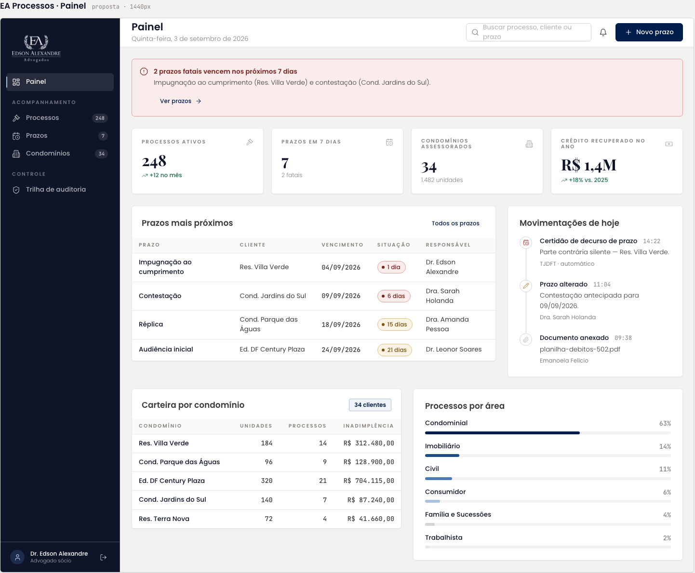

# Painel

Tela inicial da plataforma. No Figma, a barra lateral e os quatro indicadores foram reescritos para o sistema de acordos; os blocos "Prazos mais próximos" e "Movimentações de hoje" continuam como vieram do repositório.

| | |
| --- | --- |
| Origem | **Editado no Figma** a partir do Painel da EA Processos |
| Nó no Figma | [34:5130](https://www.figma.com/design/jEwHxavSrPVQrm3hGSLGtC/edson-alexandre-advogados_design-system?node-id=34-5130) |
| Fonte da tela de origem | [`ui_kits/plataforma_processos/Painel.jsx`](https://github.com/Advocondo/ui-kit/blob/main/ui_kits/plataforma_processos/Painel.jsx) |
| Componentes | `SidebarNav`, `TopBar` com `TopBarSearch`, `MetricCard` (quatro), `Card`, `DataTable`, `StatusPill`, `Timeline` |
| Histórias de usuário | [US34](../historias/ep05-comissoes-metas.md#us34) (dashboard de indicadores), sem filtro por período. Ver a [cobertura das histórias](cobertura-historias.md). |

## O que a tela mostra

**Barra lateral** (comum a todas as telas do sistema de acordos): Painel; seção Acompanhamento com Acordos (248), Metas e Comissões e Condomínios (34); seção Controle com Trilha de auditoria e Gestão de Usuários (7). Rodapé com o usuário "Dr. Edson Alexandre · Advogado sócio".

**Indicadores**:

| Indicador | Valor de exemplo |
| --- | --- |
| Total recuperado | R$ 45.320,00 |
| Faturas em atraso | R$ 8.450,00 |
| Acordos ativos | 142 |
| Honorários / Receita estimada | R$ 4.532,00 |

**Prazos mais próximos**: tabela com Prazo, Cliente, Vencimento, Situação e Responsável (impugnação ao cumprimento, contestação, réplica, audiência inicial), herdada da tela de origem.

**Movimentações de hoje**: linha do tempo com certidão de decurso de prazo, prazo alterado e documento anexado, também herdada.

## Tela de origem no repositório

A captura abaixo é o Painel da EA Processos como exportado do repositório, antes das edições no Figma. Serve para comparar o que mudou.

!!! info "Captura pendente"

    A versão editada ainda não tem captura exportada. Abra o [nó 34:5130](https://www.figma.com/design/jEwHxavSrPVQrm3hGSLGtC/edson-alexandre-advogados_design-system?node-id=34-5130) ou exporte o frame em PNG a 1x como `assets/prototipos/painel.png`.

## Pontos de atenção

- O rótulo "tOTAL RECUPERADO" está com a caixa trocada e "R$45.320,00" está sem espaço após o símbolo. O padrão da marca é `R$ 45.320,00`, com o rótulo em sobrelinha caixa alta.
- "Prazos mais próximos" e "Movimentações de hoje" ainda falam de processos judiciais. No sistema de acordos, o equivalente natural é "Parcelas a vencer" e "Baixas de hoje", alimentados pelo [Acompanhamento Mensal](acompanhamento-mensal.md).
- A barra lateral conta 248 acordos, mas o indicador diz 142 acordos ativos. Os dados são fictícios, mas o protótipo fica mais convincente com um único número.
- "Honorários / Receita estimada" mistura dois conceitos no mesmo card. Escolha um, ou use o `footnote` do `MetricCard` para o segundo.
