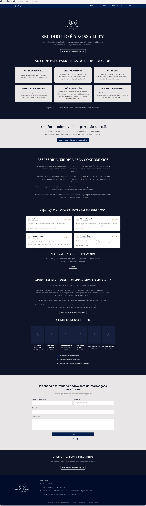

# Site institucional

Recriação da landing page pública do escritório, em 1440px e dez seções: navegação fixa, hero, áreas de atuação (grade 3×2), faixa clara de atendimento online, assessoria para condomínios, avaliações do Google, equipe com as três afirmações, formulário de contato, convite para visita e rodapé.

| | |
| --- | --- |
| Origem | **Importado** da folha HTML, sem alteração |
| Nó no Figma | [34:4644](https://www.figma.com/design/jEwHxavSrPVQrm3hGSLGtC/edson-alexandre-advogados_design-system?node-id=34-4644) |
| Fonte no repositório | [`ui_kits/site_institucional/`](https://github.com/Advocondo/ui-kit/tree/main/ui_kits/site_institucional) (todas as seções em `Sections.jsx`) |
| Componentes | `SectionTitle`, `PracticeCard`, `TeamCard`, `Button` (`primary` e `outline` sobre navy), `Card`, `Input`, `Textarea`, `Logo`, `Icon` |
| Histórias de usuário | [US01](../historias/ep01-portal-autenticacao.md#us01) (landing page institucional). Falta o ponto de entrada para o Login que a US01-CA03 pede. Ver a [cobertura das histórias](cobertura-historias.md). |

## Captura

A captura abaixo foi exportada do próprio Figma.

??? note "Página completa (1440 × 4964)"

    

## Pontos de atenção

- Os textos dos cards de avaliação foram parafraseados por ilegibilidade na captura de tela original. Substitua pelos reviews reais antes de qualquer uso público.
- As fotos da equipe não acompanham o repositório; no Figma os retratos aparecem como placeholder navy.
- As marcas sociais (WhatsApp, Facebook, Instagram) são substituições Lucide. Para produção, use as marcas oficiais.
- A fileira da equipe é um carrossel no site real; aqui é uma fileira estática.
