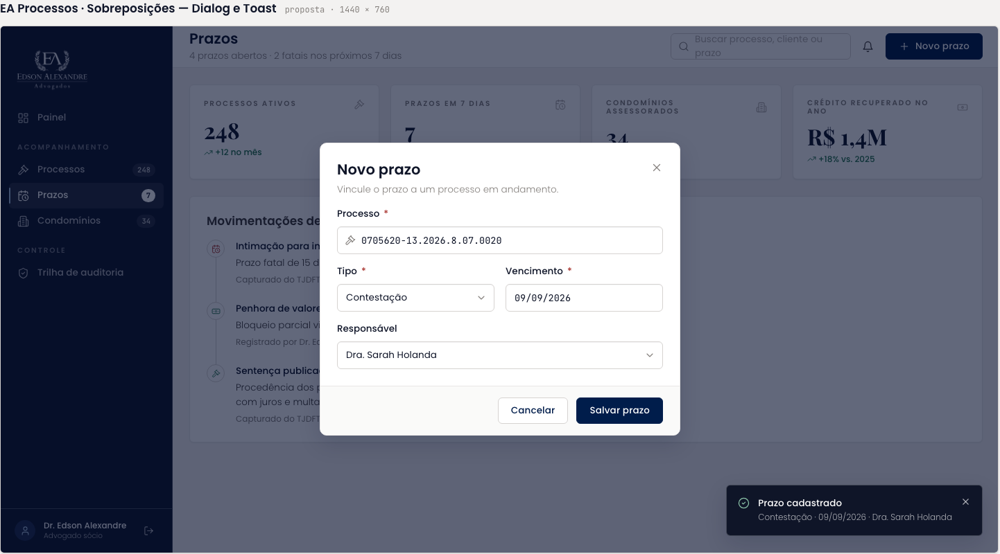

# Sobreposições

Tela de demonstração das camadas flutuantes: a tela de Prazos ao fundo, o `Dialog` "Novo prazo" aberto sobre o véu navy e o `Toast` "Prazo cadastrado" no canto inferior direito.

| | |
| --- | --- |
| Origem | **Importado** da folha HTML; a barra lateral recebeu um ajuste pontual no Figma ("Acordos" no lugar de "Processos") |
| Nó no Figma | [34:7199](https://www.figma.com/design/jEwHxavSrPVQrm3hGSLGtC/edson-alexandre-advogados_design-system?node-id=34-7199) |
| Fonte no repositório | [`ui_kits/plataforma_processos/App.jsx`](https://github.com/Advocondo/ui-kit/blob/main/ui_kits/plataforma_processos/App.jsx) (diálogo e toast do shell) sobre [`Prazos.jsx`](https://github.com/Advocondo/ui-kit/blob/main/ui_kits/plataforma_processos/Prazos.jsx) |
| Componentes | `Dialog`, `Toast`, `FieldLabel`, `Input mono`, `Select`, `Button`, sobre `SidebarNav`, `TopBar`, `MetricCard`, `Timeline` |

## O que a tela mostra

- Diálogo "Novo prazo": "Vincule o prazo a um processo em andamento." Campos Processo (0705620-13.2026.8.07.0020), Tipo (Contestação), Vencimento (09/09/2026) e Responsável (Dra. Sarah Holanda). Ações Cancelar e "Salvar prazo".
- Toast "Prazo cadastrado · Contestação · 09/09/2026 · Dra. Sarah Holanda".
- Ao fundo, a tela de Prazos com os quatro indicadores e as movimentações de hoje.

## Captura

A captura abaixo vem da folha HTML. No Figma, a única diferença é o rótulo "Acordos" na barra lateral.

## Pontos de atenção

- Esta é a referência de comportamento dos diálogos do sistema de acordos (Novo Acordo, Importar Inadimplentes, Registrar Baixa, Novo condomínio, Convidar Membro): véu navy a 62%, título, descrição, campos e rodapé com Cancelar à esquerda da ação primária.
- O rótulo "Salvar prazo" deste diálogo foi copiado por engano para os diálogos de Condomínios e de Gestão de Usuários. Cada diálogo precisa do próprio verbo.
- A barra lateral aqui ficou no meio do caminho: mostra "Acordos", mas não "Metas e Comissões" nem "Gestão de Usuários". Se a tela continuar no arquivo, alinhe a barra lateral com as demais.
