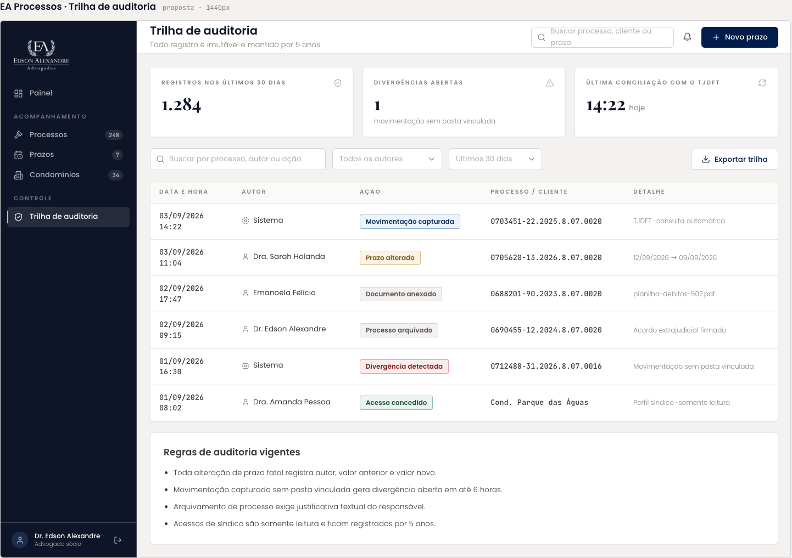

# Trilha de auditoria

Registro imutável das ações no sistema. Herdou o nó da tela de Trilha de auditoria da EA Processos; os exemplos de ação foram trocados para o domínio de acordos e o card "Regras de auditoria vigentes" da origem não aparece mais.

| | |
| --- | --- |
| Origem | **Editado no Figma** |
| Nó no Figma | [34:6869](https://www.figma.com/design/jEwHxavSrPVQrm3hGSLGtC/edson-alexandre-advogados_design-system?node-id=34-6869) |
| Fonte da tela de origem | [`ui_kits/plataforma_processos/Auditoria.jsx`](https://github.com/Advocondo/ui-kit/blob/main/ui_kits/plataforma_processos/Auditoria.jsx) |
| Componentes | `SidebarNav`, `TopBar`, `MetricCard` (dois), `Input icon="search"`, `Select` (autor, período), `Button` (exportar), `DataTable`, `Badge` (ação) |
| Histórias de usuário | [US31](../historias/ep04-parcelas.md#us31) (log de baixa, edição e estorno) e [US11](../historias/ep02-usuarios-perfis.md#us11) (histórico da gestão de usuários). Ver a [cobertura das histórias](cobertura-historias.md). |

## O que a tela mostra

- Indicadores: Registros nos últimos 30 dias 1.284; Divergências abertas 1.
- Filtros: busca "Buscar por processo, autor ou ação", "Todos os autores", "Últimos 30 dias" e a ação "Exportar planilha".
- Colunas: Data e hora, Autor, Ação, Processo / condominio, Detalhe.

| Data e hora | Autor | Ação | Processo / condomínio | Detalhe |
| --- | --- | --- | --- | --- |
| 03/09/2026 14:22 | Sistema | Baixa de Parcela | Reserva Águas Claras | Registrou pagamento da parcela 01/06 |
| | | Alteração de Acordo | Cond. Lake View | Desfez a baixa da parcela 02/03 |
| | | Inativação de Usuário | estagiario@escritorio.com.br | Inativou o acesso do usuário "estagio@escritorio.com.br" |

## Tela de origem no repositório

!!! info "Captura pendente"

    A versão editada ainda não tem captura exportada. Abra o [nó 34:6869](https://www.figma.com/design/jEwHxavSrPVQrm3hGSLGtC/edson-alexandre-advogados_design-system?node-id=34-6869) ou exporte o frame em PNG a 1x como `assets/prototipos/trilha-de-auditoria.png`.

## Pontos de atenção

- As ações de exemplo já falam a língua do sistema de acordos (Baixa de Parcela, Alteração de Acordo, Inativação de Usuário). Esse é o ponto forte da tela.
- "condominio" no cabeçalho está sem acento, e o placeholder da busca ainda cita "processo". O rótulo natural é "Acordo / condomínio".
- Uma baixa manual registrada com autor "Sistema" contradiz a ideia de trilha: a baixa é feita por uma pessoa. Reserve "Sistema" para ações automáticas.
- Na linha de inativação, o autor é `estagiario@` e o usuário inativado é `estagio@`. Se são a mesma pessoa, é um erro de exemplo; se não, o autor deveria ser um administrador.
- O card "Regras de auditoria vigentes" da tela de origem (imutabilidade, dupla confirmação de prazo fatal) sumiu. Vale voltar com regras do domínio de acordos, por exemplo: baixa desfeita exige justificativa; cancelamento de acordo exige um sócio.
